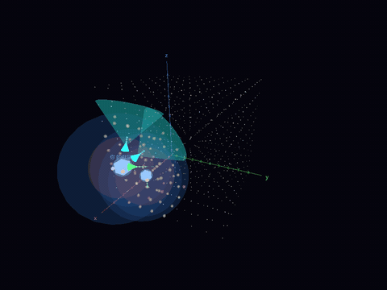
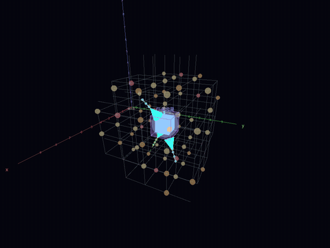
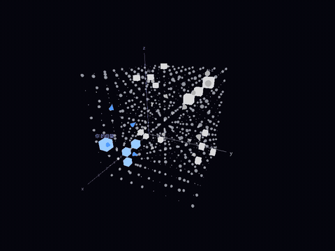
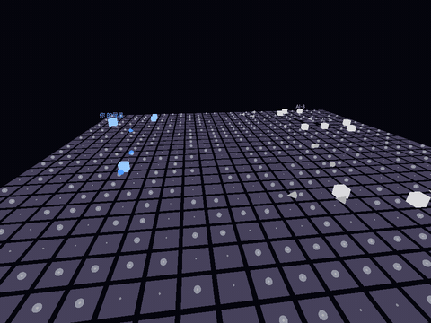

<div align="center">

# 黑暗森林 · Dark Forest

**以《三体》黑暗森林法则为背景的 3D 回合制策略游戏**

「宇宙就是一座黑暗森林，每个文明都是带枪的猎人。」

[](https://godotengine.org/)
[](https://docs.godotengine.org/en/stable/tutorials/scripting/gdscript/)
[](docs/roadmap.md)
[](LICENSE)

[**在浏览器里玩**](https://green-heart-group.github.io/dark-forest-game/) ·
[下载 Windows 版](https://github.com/green-heart-group/dark-forest-game/releases) ·
[完整规则](docs/design/current-rules.md)

<table>
  <tr>
    <td align="center" width="50%">
      <br>
      <b>藏在三维星图里</b><br>
      只看得到自己周围一小片，探测器飞出去看，情报按光速传回
    </td>
    <td align="center" width="50%">
      <br>
      <b>黑域</b><br>
      一格的光速变成 0，再慢慢向周围扩散；躲在里面打不进来，自己也出不去
    </td>
  </tr>
  <tr>
    <td align="center" width="50%">
      <br>
      <b>二向箔</b><br>
      展开以后一圈圈扩散，把整张星图压成一个平面
    </td>
    <td align="center" width="50%">
      <br>
      <b>降到零维</b><br>
      单向著把平面压成直线，先发射奇异点、降到零维的文明获胜
    </td>
  </tr>
</table>

</div>

## 简介

在一个 9×9×9 的星图里，你和 4 个 AI 文明各自藏好自己的位置。谁先暴露，谁就可能被消灭。

玩法有点像「海战棋」：你看不见对手，只能派探测器出去看，看到的消息按光速慢慢传回来。
星图外面还藏着 15 个看不见的「隐藏文明」，你可以广播别人的坐标，让它们替你动手。

> [!NOTE]
> 项目还在原型阶段，画面只用方块和线条，规则和数值都在边玩边调。

## 玩法亮点

- 🔭 **视野和光速情报**：星系和舰船只看得到周围一小片。探测器边飞边看，看到的情报按光速传回，越旧越不可靠。
- 🔬 **科技树**：发现别人、第一次交战、能量收入够高，才能升下一级科技。
- ✨ **多种打击手段**：光粒一击毁掉整个星系，但要飞好几个回合；战舰守住附近、清除殖民船；
  二向箔把整张星图压成平面，单向著再把平面压成直线；最后发射奇异点、降到零维就赢了。
- 🕳️ **防守和躲藏**：黑域让一片空间的光速变慢，光粒在里面没有杀伤力，但舰船、情报也跟着变慢，困久了会出不来。
  预警系统报告来袭，反物质拦战舰，掩体挡光粒，自身降维以后不怕二向箔。
- 📢 **借刀杀人**：广播别人的坐标，可能引来隐藏文明的打击，自己却不暴露。
- 🛸 **星舰文明**：星系全丢了，只要还有星舰就能活下去，再找新的星系定居。
- ⭐ **恒星和行星**：恒星、类地行星和戴森球产能量；母星系恒星越多，行动点越少（原著里的「乱纪元」）。

完整规则见 [原型现在的规则](docs/design/current-rules.md)。

## 快速开始

### 准备

需要 [Godot 4.7.2](https://godotengine.org/download)（普通版，不是 .NET 版）。Windows 上可以用 winget 安装：

```bash
winget install --id GodotEngine.GodotEngine --exact --version 4.7.2
```

### 运行

在仓库根目录：

```bash
# 第一次运行前生成缓存
godot_console --headless --path game --import

# 开始游戏
godot --path game

# 打开编辑器
godot --path game --editor
```

> `godot` 是窗口版；`godot_console` 是命令行版，会等程序跑完并显示输出，适合跑测试。

### 操作

- **看星图**：左键拖动旋转，滚轮缩放；也可以用键盘平移、旋转（星图左上角「视角操作」里有说明）。
- **选目标**：单击星图上的东西选中它；单击空处可以瞄准那一格。点不准时，在面板里直接输入 x、y、z 坐标。
- **行动**：右侧面板分科技、建造、行动、情况四页。升级科技不花行动点；建造、派出单位、发射武器各花 1 个行动点。
  最后按「结束回合」。鼠标停在按钮上能看到说明。
- **重开**：回合状态旁边的「🔄 重开」随时可以换一张新星图，或者在同一张星图上从头打。
- **界面大小**：拖动窗口时界面跟着缩放；按 Ctrl + 加号 / 减号调整字的大小，Ctrl + 0 恢复。
- **开发者调试**：按 F12 打开调试面板，可以换成任意文明的视角、播放和回退对局、随时改数值。
  `godot --path game -- watch seed=123` 开一局全由 AI 打的观战局。详见 [调试模式](docs/guides/debug-tools.md)。

## 开发

### 目录结构

```text
game/
├── rules/    规则代码：不依赖任何画面节点，所有数值在 balance.gd
├── view/     画面代码：只读取规则数据
├── tests/    规则测试（rules/ 里按规则分文件）和画面测试
├── tools/    跑测试、变异测试、平衡模拟、生成数值目录、做网页字体、录 README 的动图
└── balance_presets/  共享的数值方案（和 balance.gd 不一样的一组数值）
docs/         设计、要确定的问题、现状、路线图、开发日志、提议和重要决定（入口 docs/README.md）
```

每个文件管什么、改代码要守的规矩见 [代码结构](docs/guides/code.md)。
改动都从新分支通过 PR 合并进 `master`，见 [分支和合并](docs/decisions/0003-github-flow.md)。

### 测试和平衡模拟

```bash
# 跑全部测试：先导入，再同时开几个进程跑规则测试和画面测试（GitHub 上跑的也是这一条）
uv run game/tools/test.py

# 只跑规则测试里名字带 ai 的（rules 换成 view 就是画面测试；--no-import 跳过导入；--jobs 1 只用一个进程）
uv run game/tools/test.py rules --only ai

# 也可以直接用 Godot 跑某一种测试，最后加 -- only=词 只跑名字里带这个词的
godot_console --headless --path game --script res://tests/run_tests.gd
godot_console --headless --path game --script res://tests/run_view_tests.gd

# 变异测试：给 game/rules/ 里的文件故意造小错，看测试能不能发现，列出没发现的（很慢，只在本地跑）
# 文件名换成 all 是全部文件；加 --view 时规则测试没发现的再跑画面测试；--out 文件 另存结果
uv run game/tools/mutate.py geometry.gd

# 平衡模拟：5 个文明全由 AI 控制，打 50 局（默认分给几个进程同时跑，JOBS=1 时只用一个）
godot_console --headless --path game --script res://tools/simulate.gd

# 找哪里慢：最后列出回合里每一步一共花了多少秒
godot_console --headless --path game --script res://tools/simulate.gd -- PROFILE=1 RUNS=10

# 临时覆盖 balance.gd 里的数值（整数或小数；数组、字典要用数值方案）
godot_console --headless --path game --script res://tools/simulate.gd -- TIER3_ENERGY=40 RUNS=100

# 用一个数值方案（game/balance_presets/ 里的，或调试面板里存的自己的方案）
godot_console --headless --path game --script res://tools/simulate.gd -- PRESET=方案名
```

### 发布

推送 `v` 开头的标签（如 `v0.1.0`）后，GitHub 自动跑测试，导出 Windows exe 和网页版：

- exe 打包挂到 [Releases](https://github.com/green-heart-group/dark-forest-game/releases)：
  `dark-forest-windows.zip` 是普通版，`dark-forest-windows-dev.zip` 是一打开就有调试面板的开发者版。
- 网页版发到 <https://green-heart-group.github.io/dark-forest-game/>；
  带调试面板的网页版在 <https://green-heart-group.github.io/dark-forest-game/dev/>（见 [调试模式](docs/guides/debug-tools.md#怎么打开)）。
- 标签里带「-」（如 `v0.1.0-test`）的标成预发布。步骤写在 [`.github/workflows/release.yml`](.github/workflows/release.yml)。

```bash
git tag v0.1.0
git push origin v0.1.0
```

本地导出（需要先在 Godot 编辑器「编辑器 → 管理导出模板」里下载模板）：

```bash
godot_console --headless --path game --export-release "Windows Desktop" ../build/dark-forest.exe
godot_console --headless --path game --export-release "Windows Desktop (dev)" ../build/dark-forest-dev.exe

# 网页版：网页里用不了电脑上装的字体，先做好随游戏带的字体，再导入、导出
uv run game/tools/make_web_fonts.py
godot_console --headless --path game --import
godot_console --headless --path game --export-release "Web" ../build/web/index.html
```

## 文档

所有文档从 [docs/README.md](docs/README.md) 进。常看的几份：

- [原型现在的规则](docs/design/current-rules.md)：试玩时对照。
- [现状](docs/status.md)：做到哪一步、测试和平衡模拟结果。
- [路线图](docs/roadmap.md)：接下来要做什么。
- [要确定的问题](docs/open-questions.md)：还没定、要大家回答的问题。
- [决定记录](docs/design/game-design.md#14-决定记录)：每条规则是谁、什么时候、为什么定的。

## 旧版本

最早的 Python 版（Tkinter + Matplotlib）已归档在 [`archive/python`](https://github.com/green-heart-group/dark-forest-game/tree/archive/python) 分支，不再更新。

## 致谢

灵感来自刘慈欣的科幻小说《三体》。本项目是爱好者作品，与原著及其版权方无关。

## 许可证

[MIT](LICENSE)
