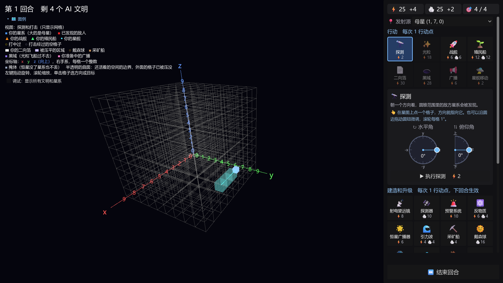

<div align="center">

# 黑暗森林 · Dark Forest

**以《三体》黑暗森林法则为背景的 3D 回合制策略游戏**

「宇宙就是一座黑暗森林，每个文明都是带枪的猎人。」

[](https://godotengine.org/)
[](https://docs.godotengine.org/en/stable/tutorials/scripting/gdscript/)
[](docs/roadmap.md)
[](LICENSE)



</div>

## 简介

在一个 10×10×10 的星图里，你和 4 个 AI 文明各自藏好自己的位置。谁先暴露，谁就可能被消灭。

玩法有点像「海战棋」：你看不见对手，只能朝某个方向探测、开火，然后得知打没打中。
另外还有 15 个看不见的「隐藏文明」，你可以广播别人的坐标，让它们替你动手。

> [!NOTE]
> 项目还在原型阶段，画面只用方块和线条，规则和数值都在边玩边调。

## 玩法亮点

- 🔭 **盲打和探测**：用水平角、俯仰角两个圆盘指定方向，在圆锥范围里寻找敌人的星系。
- ✨ **多种打击手段**：光粒当回合打到；战舰便宜但飞得慢；二向箔把整张星图压成一个平面；进入二维后还能发射单向箔，把平面继续压成一条直线。
- 🕳️ **防守和躲藏**：黑域挡住光和飞船，预警系统、反物质、掩体能抵消攻击，自身降维后不怕二向箔，二维世界里再次降维后才能抵挡单向箔。
- 📢 **借刀杀人**：广播别人的坐标，可能引来隐藏文明的打击，自己却不暴露。
- 🛸 **星舰文明**：星系全丢了，只要还有星舰就能活下去，再找新的星系定居。
- ⭐ **恒星决定一切**：恒星越多，能量越多，但行动点越少（原著里的「乱纪元」）。

完整规则见 [原型现在的规则](docs/design/current-rules.md)。

## 快速开始

### 准备

需要 [Godot 4.7.2](https://godotengine.org/download)（普通版，不是 .NET 版）。Windows 上可以用 winget 安装：

```bash
winget install --id GodotEngine.GodotEngine --exact --version 4.7.2
```

### 运行

在仓库根目录：

```bash
# 第一次运行前生成缓存
godot_console --headless --path game --import

# 开始游戏
godot --path game

# 打开编辑器
godot --path game --editor
```

> `godot` 是窗口版；`godot_console` 是命令行版，会等程序跑完并显示输出，适合跑测试。

### 操作

- 左键拖动旋转星图，滚轮缩放。
- 单击格子，自动算好方向和距离；也可以沿圆盘边缘拖动微调。
- 在右侧面板选行动或建造，每项花 1 个行动点，最后按「结束回合」。

## 开发

### 目录结构

```text
game/
├── rules/    规则代码：不依赖任何画面节点，所有数值在 balance.gd
├── view/     画面代码：只读取规则数据
├── tests/    规则测试
└── tools/    平衡模拟
docs/         设计、路线图、开发日志和重要决定
```

### 测试和平衡模拟

```bash
# 跑规则测试
godot_console --headless --path game --script res://tests/run_tests.gd

# 场景与完整交互回归（不加 --headless 可同时检查原生画面）
godot_console --headless --path game --script res://tests/run_view_tests.gd

# 平衡模拟：5 个文明全由 AI 控制，打 50 局
godot_console --headless --path game --script res://tools/simulate.gd

# 临时覆盖 balance.gd 里的数值
godot_console --headless --path game --script res://tools/simulate.gd -- COST_PROBE=8 RUNS=100
```

## 路线图

- [x] 星图生成、探测、光粒、战舰、殖民船
- [x] 二向箔、黑域、广播和隐藏文明
- [x] 防守手段：预警系统、反物质、掩体、自身降维
- [x] 星舰文明和 AI 对手
- [x] 连续降维：3D → 2D → 1D，二维继续游戏，支持单向箔和再次自身降维
- [ ] 平衡调整（二维不再判平局；一维终局和新阶段的数值仍待试玩）
- [ ] 存档读档、能量力场
- [ ] 更聪明的 AI、多人对战、原著事件卡

详见 [路线图](docs/roadmap.md) 和 [待讨论的问题](docs/open-questions.md)。

## 文档

| 文档 | 内容 |
| --- | --- |
| [docs/README.md](docs/README.md) | 文档索引 |
| [game-design.md](docs/design/game-design.md) | 目标设计 |
| [current-rules.md](docs/design/current-rules.md) | 原型现在实际的规则，试玩时对照 |
| [roadmap.md](docs/roadmap.md) | 路线图 |
| [open-questions.md](docs/open-questions.md) | 现状和待讨论的问题 |
| [devlog/](docs/devlog/README.md) | 开发日志 |

## 旧版本

最早的 Python 版（Tkinter + Matplotlib）已归档在 [`archive/python`](../../tree/archive/python) 分支，不再更新。

## 致谢

灵感来自刘慈欣的科幻小说《三体》。本项目是爱好者作品，与原著及其版权方无关。

## 许可证

[MIT](LICENSE)
