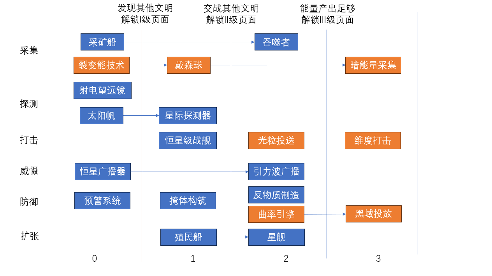

# 游戏设计（目标版本）

这里描述的是要做成的样子和为什么这样做。原型已经按这里做了大部分；
原型实际怎么做、具体数值见 [原型现在的规则](current-rules.md)，两者不一样的地方以这里为准。
具体任务见 [路线图](../roadmap.md)。

最早的底子是 E7F6 的交接文档（已归档到 [archive/handoff-2026-10-03.md](archive/handoff-2026-10-03.md)），
和旧版不一样的地方见 [§11](#11-和旧版的差异)。

**怎么追溯一条规则**：正文括号里的编号（例如 B7、G13.4、T9、F2.2）是定下这条规则的决定，
每个编号在 [§14 决定记录](#14-决定记录) 里都查得到是什么时候、谁定的、讨论过程在哪里。
写着「暂定」并链接到 [要确定的问题](../open-questions.md) 的，是 E7F6 还没确认、先按推荐做的；
E7F6 改了答案，再改这里和代码。

**目录**：[1 舞台和身份](#1-舞台和身份) · [2 一局的节奏](#2-一局的节奏) · [3 时间、距离和移动](#3-时间距离和移动) ·
[4 情报](#4-情报) · [5 科技树、建造和调度](#5-科技树建造和调度) · [6 各个单位和打击](#6-各个单位和打击) ·
[7 防守手段](#7-防守手段由弱到强) · [8 广播和隐藏文明](#8-广播和隐藏文明) · [9 降维](#9-降维) ·
[10 设计方向](#10-设计方向) · [11 和旧版的差异](#11-和旧版的差异) · [12 写进设计时补的暂定做法](#12-写进设计时补的暂定做法) ·
[13 待定数值](#13-待定数值) · [14 决定记录](#14-决定记录)

**用词**（所有文档都按这里的叫法）：

- **母星系**：开局时自己的星系。游戏界面地方小，简称「母星」。
- **殖民星系**：后来殖民得到的星系，也叫殖民地。母星系和殖民星系合称「自己的星系」。
- **舰船**：探测器、战舰、殖民船、星舰、吞噬者这些会飞的单位。不说「飞船」。光粒、智子、降维箔在哪些规则里算不算，各条规则里单独写。
- **战舰**：恒星级战舰的简称。
- **降维箔**：二向箔、单向著的合称。
- **行动点**：[原型现在的规则](current-rules.md) 的表格里简写成 AP。
- **上帝视角**：调试面板里画出所有文明的开关（试玩意见里叫过「全知者模式」）。

## 一句话

在 10×10×10 的星图里，各个文明藏起自己的位置，想办法先看到别人，再用有方向或指定坐标的武器打击。
光速是最快的速度，什么东西都要飞很多回合，情报也要按光速传回来。科技要先发现别人、再和别人的舰船碰上以后才能往上升。

## 1. 舞台和身份

- 星图有 1000 个格子（10×10×10），最多一个星系。大约一半的格子有星系
  （单星最多，双星其次，三星最少），星系里有类地行星和类木行星；有宜居类地行星的星系可以殖民，
  有类木行星的星系可以建掩体。生成方法见 [原型现在的规则](current-rules.md)，不变。星图先不放大（G11）。
- 每局随机生成星图，各文明的母星系随机放在能殖民的星系上（F1.1），彼此至少隔开 5 格，
  开局一定看不到别人（F3.1）。
- 坐标用右手系，x、y、z 都是 0～9 的整数，z 轴是高度（朝上）。
- 星系的位置不公开。平时画面只显示网格、自己的东西和看到过的情报。哪些星系宜居也要看到过才知道；
  派殖民船、星舰选目的地时，标出看到过的宜居星系（F4.4）。
- 一个人类玩家对 4 个 AI 文明，另外还有 15 个看不见的「隐藏文明」（见 [§8](#8-广播和隐藏文明)）。
- **恒星和行星决定实力**：
  - 行动点 = 6 − 母星系的恒星数，每多一个殖民地 +1；殖民地的恒星数不影响行动点（E2，原著的「乱纪元」：母星恒星多，环境不稳定）。
  - 能量收入：每颗恒星 +3E，每颗类地行星 +1E，再加戴森球（见 [§5](#5-科技树建造和调度)）；星系本身不产能量（F2.1）。
    能建几个戴森球看自己所有星系的恒星总数。
  - 没有恒星的星系没有恒星和戴森球的产能，其余产出不变。
- **文明的据点**：母星系、殖民星系和星舰。三样都没有了，这个文明就灭亡、输掉。

## 2. 一局的节奏

参考实体桌游「海战棋」：双方暗中摆放，轮流盲打，对方只告诉你打没打中。

1. **找人和殖民**：一开始只有 0 级科技。派探测器、升级射电望远镜，想办法看到别人的星系；
   找不到别人时，可以先派殖民船发展自己的殖民地（F1.4）。
   E7F6 预计这一段会很长：宇宙够大，博弈才有意思。没发现别人，就领悟不到宇宙是黑暗森林，也升不了更高的科技（T4）。
2. **发展**：发现别人以后能升 I 级科技：戴森球、战舰、掩体、星舰。
3. **交锋**：两个文明的交锋通常从发现对方的航迹或舰船开始。I 级开放以后，自己的舰船第一次和对方的舰船接触，就能升 II 级：光粒、反物质、曲率引擎、次声波氢弹、智子（E8）。
4. **打击和反馈**：每次打击后知道打没打中，结果记在一张只有自己能看的「敌情记录图」上
   （相当于海战棋里记录结果的竖板）。被打的一方知道打击从哪个方向来。
5. **借刀杀人**：广播别人的坐标，可能引来隐藏文明替你出手。
6. **降维**：能量收入够高以后能升 III 级：二向箔、黑域投放。二向箔展开后会压平整张星图，
   没有自身降维的文明都会灭亡；之后在二维、一维继续打。

## 3. 时间、距离和移动

### 时间和距离

- 1 格 = 1 光年，1 回合 = 1 年。所以光速是每回合 1 格，也是游戏里最快的速度。
- 格子之间的距离永远是 1。黑域会把附近格子的光速拉低，那里的一切都变慢，宇宙看起来像在膨胀（G14，见 [§7 黑域](#黑域g14)）。
- 准备回合（二向箔、黑域、自身降维等）先不跟着改，跑完平衡模拟再一起调（G10）。

### 速度和加速度

会动的单位从静止开始加速，每回合速度增加「加速度」，加到最高速度后不再变。单位都是「格 / 回合」。
每回合先加速，再按新速度移动（G1），所以第一回合走的距离等于加速度。

| 单位 | 最高速度 | 加速度 | 飞 1 格 | 3 格 | 5 格 | 10 格 | 有没有目的地 |
| --- | --- | --- | --- | --- | --- | --- | --- |
| 光粒 | 1.0 | 0.5 | 2 回合 | 4 | 6 | 11 | 没有，一直飞 |
| 探测器 | 0.99 | 0.02 | 10 | 17 | 22 | 32 | 没有 |
| 星际探测器 | 0.99 | 0.1 | 4 | 8 | 10 | 15 | 没有；飞到别人的星系时停下 |
| 恒星级战舰 | 0.8 | 0.1 | 4 | 8 | 10 | 16 | 没有；可以下令转向 |
| 星舰 | 0.6 | 0.1 | 4 | 8 | 11 | 20 | 有，到了就停下 |
| 殖民船 | 0.2 | 0.05 | 7 | 17 | 27 | 52 | 有，目的地星系 |
| 吞噬者 | 0.15 | 0.03 | 9 | 22 | 36 | 69 | 没有；可以下令转向 |
| 二向箔、单向著（展开前） | 0.2 | 不加速 | 5 | 15 | 25 | 50 | 有，目标坐标 |

- 装了曲率引擎的舰船（科技 205）：在自己星系的视野外自动以光速飞（最高 1.0，加速度 1.0）；在视野内按原来的速度飞。
- 「恒星级战舰」平时简称战舰。E7F6 在一些决定里写成「舰队」，指的是同一个东西。

### 位置和到达

- 飞行中严格沿方向走直线，位置用小数记，不再一格一格地走。
- 有目的地的单位：某一步离目的地的距离已经小于这一步的速度，这一步就直接落在目的地上，不会飞过头。
- 没有目的地的单位一直飞，飞出星图就消失。
- 星系还在格子上。飞行中碰到了什么，看这一步扫过的圆柱碰到了哪些格子。
- 战舰转向花 1 行动点 + 2E，速度不变；转向超过 90° 时速度归零，重新加速（G8）。
- 星舰停下后，下次移动重新加速。

## 4. 情报

### 情报从哪里来

所有文明（玩家和 AI）知道别人的事，只有这几种途径（F1.2）：

- **自己的东西看到**：星系、舰船、探测器的视野，见下面。
- **监听广播**：广播里公开的坐标，见 [§8](#8-广播和隐藏文明)。
- **被打**：光粒和战舰打到自己的星系，就知道打击从哪个**方向**来，但不知道距离。
  被预警、反物质、掩体挡下的也算；被黑域挡住的不算，因为没打到。二向箔不给方向（G6）。
  画面从被打的星系朝来处画一条射线；AI 也会朝这个方向派探测器或反击。
- **预警系统**：敌方的战舰、光粒、二向箔或单向著进入预警范围，就知道它的位置（见 [§7](#7-防守手段由弱到强)）。

### 视野

| 单位 | 视野的形状 | 开始的大小 |
| --- | --- | --- |
| 母星系 | 以自己为中心的球 | 半径 2.0 |
| 殖民星系、星舰 | 以自己为中心的球 | 半径 1.5 |
| 恒星级战舰 | 以自己为中心的球 | 半径 1.0 |
| 殖民船、吞噬者 | 以自己为中心的球 | 半径 1.0（暂定，见 [§12](#12-写进设计时补的暂定做法)） |
| 探测器 | 朝飞行方向张开的圆锥，尖在探测器上 | 张角 15°，长 1.0 |
| 星际探测器 | 同上 | 张角 30°，长 1.5 |

- 半径 1.0 只看到上下左右前后 6 个相邻格子；1.5 比 $\sqrt{2}$ 大，共用一条棱的也看得到，一共 18 格；
  2.0 比 $\sqrt{3}$ 大，周围一圈 26 格加上 6 个方向上隔一格的，一共 32 格。
- 升级射电望远镜（科技 003）：最多升 4 次。每次所有视野半径和探测器圆锥的长度都 +0.5；
  圆锥张角 +15°，最大 60°（普通探测器升到第 3 次就到 60°，星际探测器第 2 次）。升满时母星系看 4.0 格，
  殖民星系和星舰 3.5，战舰和普通探测器 3.0（T18、T22）。
- 星系和星舰一直看着，每回合按当前位置更新（G7.3）。
- 会飞的东西（探测器、舰船）只看到它飞过那一刻的样子。飞过一个星系以后，那里再有变化，你不会知道，
  除非再派东西过去。
- 视野里能看到敌方的星系、舰船和航迹（G12.1）。

### 情报按光速传回

看到的东西不会马上知道（G7.6）：

- 情报以光速（每回合 1 格）传回最近的自己的据点（母星系、殖民星系或星舰）。
- 敌方文明的位置、战舰、航迹，要传回母星系以后才显示在星图上。
- 其他细节传回以后，鼠标停在星系上能看到信息框。
- 星系和星舰自己的视野不用传，当回合就知道。

### 能看到什么

鼠标停在一个看到过的坐标上，显示：

1. 几星系统（单星、双星、三星）。
2. 行星数量，分类木行星和类地行星。
3. 有没有文明。
4. 文明的发展情况：戴森球、战舰、广播器、光粒、二向箔。
5. 「第 N 回合看到」，越旧的颜色越淡（G12.3）。

「文明等级」「科技实力」以后按科技树来算，现在先用发展情况代替（G12.2）。

### 发现别人

自己的母星系、殖民星系、战舰、探测器看到别人的**星系或舰船**（光粒除外），或者听到广播，就算发现别人；
看到的从情报传回母星系的那一回合算（B8、T3、F2.2）。只看到航迹不算发现。
发现别人以后才能升 I 级科技。

### 航迹

- 所有文明的舰船只要以近光速（每回合超过 0.9 格）飞过，就留下航迹，画成黑色线段。
  现在会这样飞的是探测器和装了曲率引擎的舰船；光粒不是舰船，不留（G13.1）。
- 航迹一直留着，直到那片空间被降维（G13.2）。
- 航迹落进自己的视野，就显示出来，看到以后一直记住；看不出是谁留下的（G13.3）。
- 原著里的「死线」：航迹不挡任何东西（G13.5）。曲率引擎的舰船可以重复走同一条航迹
  （T21）。以后再考虑让舰船在死线附近飞时，
  有机会把死线扩大成黑域。
- 发射探测器时可以选「先慢速飞出视野」：以 0.15 的速度飞出自己星系的视野，再开始加速，
  这样航迹不会直直指着自己的母星系（G13.4）。

## 5. 科技树、建造和调度

图横着分 4 级，竖着分 6 类（采集、探测、打击、威慑、防御、扩张），箭头表示前置。
方块的蓝色和橙色只是设计时参考用，和规则无关（T1）。图里的「太阳帆」就是探测器。

### 科技分级

| 等级 | 什么时候**可以**升级 | 包含 |
| --- | --- | --- |
| 0 级 | 开局就有 | 采矿船、裂变能技术、射电望远镜、探测器、恒星广播器、预警系统、殖民船 |
| I 级 | 第一次发现别人以后：看到了别的文明的星系或舰船，或者听到了广播（F2.2） | 戴森球、星际探测器、恒星级战舰、掩体构筑、星舰、高能粒子束、星际鱼雷 |
| II 级 | I 级开放以后，自己的任何舰船和别的文明的舰船接触（相距 1.0 格以内），双方都算；光粒、智子、战舰打星系不算（E8） | 吞噬者、光粒投送、引力波广播、反物质制造、曲率引擎、次声波氢弹、智子 |
| III 级 | II 级开放以后，每回合的能量收入达到 35E（E8） | 暗能量采集、维度打击、黑域投放 |

三级按顺序开（E8）：前一级开放以前，后一级的条件达到了也不算。II、III 级最早在前一级开放一段时间（8 回合）以后才开放，
让文明先发展一阵，不会连着开两级。被智子锁住时，等级条件也不算（D5）。

殖民船原来在 I 级（105），星舰原来在 II 级（206），后来各提前一级，编号改成 007 和 106（F1.4）。

- 达到条件**不会**自动得到这一级的科技，只是可以开始升级。每项科技要另外花资源升级。
- 每项科技单独定价，越高级、收益越高的越贵；先由 AI 拟定，平衡模拟后再调（T2）。数值放在 `balance.gd`。
- 同一级里先升哪项由玩家自己选。例如三星系的文明最需要戴森球，单星系就没那么急。
- 0 级的科技开局就能用，不用升级（射电望远镜、预警系统可以额外升级）。

### 行动点

- 升级科技**不花**行动点（T15）。
- 建造和调度每次花 1 行动点。

### 界面：科技树、建造、调度

按钮分开，让玩家一眼分清：

- **科技**：花资源升级科技。
- **建造**：造单位和设施。升级了一项科技，这里就多出对应的东西。
- **调度**：让已有的单位行动（发射、移动、转向、广播、用反物质……）。原型里这一页叫「行动」。
- 同时有多个单位时，用下拉菜单选要动哪一个，和选「发射源」一样。

### 单位数量

| 单位 | 同时最多 |
| --- | --- |
| 探测器、星际探测器 | 不限 |
| 恒星级战舰 | 3 艘 |
| 殖民船 | 2 艘 |
| 星舰 | 1 艘 |
| 智子 | 2 个（暂定） |
| 反物质 | 存 1 份 |
| 光粒 | 每个星系存 1 颗（G2） |

探测器要的矿石比战舰少很多。

### 0 级（开局就有）

| 编号 | 科技 | 效果 |
| --- | --- | --- |
| 001 | 采矿船 | 建造栏有「采矿船」。每艘每回合 +2M，每个星系最多 5 艘（C4、F3.5）。 |
| 002 | 裂变能技术 | 自己星系里的每颗类地行星每回合 +1E（F2.1）。 |
| 003 | 射电望远镜 | 可以升级，最多 4 次，每次所有视野 +0.5，探测器张角 +15°（最大 60°），见 [§4](#视野)。 |
| 004 | 探测器 | 建造栏有「探测器」。加速度 0.02，最高 0.99，朝指定方向飞；视野是张角 15°、长 1.0 的圆锥。 |
| 005 | 恒星广播器 | 建造栏有「恒星广播器」。在有广播器的星系执行「广播」；有了广播器才能听到别人的广播，见 [§8](#8-广播和隐藏文明)。 |
| 006 | 预警系统 | 建造栏有「预警系统」，可以升级预警范围，见 [§7](#7-防守手段由弱到强)。 |
| 007 | 殖民船 | 建造栏有「殖民船」。选一个目的地星系派出，到了就建殖民地，见 [§6](#殖民船)。 |

### I 级（第一次发现别人以后）

| 编号 | 科技 | 前置 | 效果 |
| --- | --- | --- | --- |
| 101 | 戴森球 | 裂变能技术 | 建造栏有「戴森球」。每个每回合 +6E。最多造的个数等于自己所有星系的恒星总数（C3）。 |
| 102 | 星际探测器 | 探测器 | 建造栏的「探测器」换成「星际探测器」。加速度 0.1，最高 0.99；圆锥张角 30°、长 1.5。飞到别人的星系时停下，一直看着那里，并让**那个星系**的恒星广播器不能用；对方暂时没办法赶走它（T8）。 |
| 103 | 恒星级战舰 | 探测器 | 建造栏有「恒星级战舰」。沿指定方向派出，随时可以下令转向。打击见 [§6](#恒星级战舰)。不封锁广播。 |
| 104 | 掩体构筑 | 预警系统 | 建造栏有「掩体」。只有有类木行星的星系能建，每个星系最多 1 个，建好后一直存在，见 [§7](#7-防守手段由弱到强)。 |
| 106 | 星舰 | 殖民船 | 建造栏有「星舰」，同时最多 1 艘。星舰能移动，和母星系、殖民星系一样算文明的据点。 |
| 107 | 高能粒子束 | 恒星级战舰 | 以后造的战舰带上，射程 1.5 格，每次开火花能量，打中的战舰直接毁掉（T23）。 |
| 108 | 星际鱼雷 | 恒星级战舰 | 以后造的战舰带上，射程 2.0 格，每次开火花矿石，打中 1 次伤 1 点，伤 2 点毁掉（T23）。 |

### II 级（I 级开放以后，第一次和别人的舰船接触）

| 编号 | 科技 | 前置 | 效果 |
| --- | --- | --- | --- |
| 201 | 吞噬者 | 采矿船 | 建造栏有「吞噬者」。会移动的巨型建筑，见 [§6](#吞噬者)。 |
| 202 | 光粒投送 | 无 | 建造栏有「光粒」，调度栏有「发射光粒」，见 [§6](#光粒)。 |
| 203 | 引力波广播 | 恒星广播器 | 母星系、殖民星系和以后造的每艘战舰都带引力波广播器（这样造的战舰贵一些；已经造好的不补）。这些东西还在时，可以从它们那里广播。 |
| 204 | 反物质制造 | 无 | 建造栏有「反物质」，要花大量能量，最多存 1 份，见 [§7](#7-防守手段由弱到强)。 |
| 205 | 曲率引擎 | 无 | 以后造的所有舰船（探测器、战舰、殖民船、星舰、吞噬者）都带曲率引擎，更贵：在自己星系的视野外自动以光速飞，会留下航迹（D4）。 |
| 207 | 次声波氢弹 | 恒星级战舰 | 以后造的战舰带上，射程 1.0 格，每次开火花能量和矿石；杀掉船上的人，拿回对方造这艘船花的资源（T23）。 |
| 208 | 智子 | 无 | 建造栏有「智子」，调度栏有「派出智子」，见 [§6](#智子d5)（D5）。 |

### III 级（II 级开放以后，能量收入达到 35E）

| 编号 | 科技 | 前置 | 效果 |
| --- | --- | --- | --- |
| 301 | 暗能量采集（名字待定） | 戴森球 | 按视野里的格子数，每回合得到大量能量。 |
| 302 | 维度打击 | 无 | 建造栏有降维武器（二向箔、单向著、奇异点），还能自身降维，见 [§9](#9-降维)。 |
| 303 | 黑域投放 | 曲率引擎 | 调度栏有「投放黑域」，见 [§7](#7-防守手段由弱到强)。 |

### AI 怎么升级科技

AI 和玩家用同一套等级条件和价格，按局面选先升什么（例如恒星多先升戴森球，被打过先升掩体和反物质），
再加一些随机性，让各个 AI 不一样。AI 每回合有 2% 左右的机会不花资源直接得到一项能升的科技，
表现原著的「技术爆炸」；玩家没有（D6、T16）。

### 以后再加

- 每项科技的介绍文字。

## 6. 各个单位和打击

### 光粒

- 和恒星广播器没有关系。分成两步：
  - **造光粒**（建造栏）：花矿石，造好后存在那个星系里，每个星系最多存 1 颗（G2）。
  - **发射光粒**（调度栏）：花能量，从存着光粒的星系发出。
- 沿方向飞，加速度 0.5，最高 1.0，不限射程，飞出星图才消失（B2）。
- 打击范围是半径 0.5 格的圆柱。打中路上第一个有别的文明的星系：毁掉那里的 1 颗恒星，并抹掉所有文明在那个星系的存在（B1、T10）。
  建了掩体的星系，恒星照样少一颗，但文明留下。
- 没有恒星的星系不会被光粒打中，光粒直接穿过（T11）。

### 恒星级战舰

- 沿指定方向飞，可以转向（[§3](#位置和到达)）；视野是周围 1.0 格；飞出星图就消失；进了黑域会被困住（[G14](#黑域g14)）。
- 打击（T9、B3）：
  - 碰到敌方战舰：两艘一起毁掉。带武器的战舰先开火，见下面的「战舰的武器」。
  - 碰到敌方星舰：两艘一起毁掉。
  - 没有敌方战舰时，每回合打一个目标：先打附近的敌方殖民船，再打附近没有反物质防御的敌方星系
    （抹掉那个文明在那个星系的存在）。
  - 「附近」就是战舰的视野，周围 1.0 格；每回合只打一个，顺序是敌方战舰、殖民船、星系
    （T19）。
- 战舰不封锁广播（T8）。

### 战舰的武器（T23）

- 升级了高能粒子束（107）、星际鱼雷（108）、次声波氢弹（207）以后，之后造的战舰自动带上；带的武器越多越贵。已经造好的不补装。
- 敌方战舰进了自己某种武器的射程，就自动用这种武器打，每次开火直接花资源。几种都够得着时，
  按次声波氢弹 > 高能粒子束 > 星际鱼雷的顺序选。
  - 次声波氢弹（1.0 格，能量 + 矿石）：杀掉船上的人、留下船，打的一方拿回对方造这艘船花的资源。
  - 高能粒子束（1.5 格，能量）：直接毁掉。
  - 星际鱼雷（2.0 格，矿石）：每次伤 1 点，累计 2 点毁掉。

### 智子（D5）

- 建造花 1 矿石和大量能量；派出到指定坐标花少量能量，以 0.99 的速度飞。
- 到了别的文明的母星系以后锁住它：5 回合内不能升级科技，15 回合内等级条件不算；
  它的星系、舰船和每个行动都直接让派出智子的一方看到。
- 被锁住的文明自己造出智子，以上效果全部消失。

### 探测器和星际探测器

- 沿方向飞，没有目的地，飞出星图就消失。随着飞行一点点看到圆锥里的东西。
- 星际探测器飞到别人的星系时停下，一直把那里的情况（按光速）传回来，并让那个星系的恒星广播器不能用。

### 殖民船

- 玩家选一个目的地，派出时不花能量（T13、G9）。目的地可以是星图里任意一格（不是自己的星系），
  没看到过的地方也能去（F4.4）。到了能殖民（宜居、还有恒星、没人占）就建殖民地；不能就停在那里，可以再派去别处。
- 路上碰到别的文明的战舰或星系，就被毁掉（E3）。
- 被吞噬者吃掉宜居行星的星系不能再殖民。

### 星舰

- 选目的地移动，到了就停下，速度归零。可以当发射源。
- 不能停在别人的星系上：已知的敌方星系不能选；别人悄悄占着的，飞到离它 1 格的地方才发现，停在那里（§12，T22）。
- 和母星系、殖民星系一样算据点；视野半径 1.5。
- **定居**：停在没人占的宜居星系上时，可以花 1 行动点在那里建立新的星系，星舰用掉（T22）。
  星系全丢了、只剩星舰的文明靠它重新开始（据点见 [§1](#1-舞台和身份)）。

### 吞噬者

- 沿指定方向移动，和战舰一样可以下令转向。加速度 0.03，最高 0.15。
- 每经过一个没有别的文明的星系，自动停 1 回合，吃掉那里的 1 颗类地行星，得到大量矿石。
- 不能吃别人星系里的行星。吃掉了宜居行星的星系不能再殖民（T14）。

### 二向箔和降维武器

见 [§9](#9-降维)。

## 7. 防守手段（由弱到强）

| 手段 | 科技 | 作用 |
| --- | --- | --- |
| 预警系统 | 006（0 级） | 敌方的战舰、光粒、二向箔或单向著一进入预警范围，就告诉玩家它的位置（C1、T12）；已经压不了东西的箔不报（F5.3）。不抵消打击。预警范围开始是 2.0 格，可以升级（暂定，见 [§12](#12-写进设计时补的暂定做法)）。 |
| 反物质 | 204（II 级） | 敌方战舰到了自己星系 1.0 格以内时，可以用掉 1 份反物质让它消失。要玩家下令，花 1 行动点（C2、G6）。最多存 1 份。战舰能不能带上反物质还没定，见 [T24](../open-questions.md#t24-战舰带反物质)。 |
| 掩体（类木行星护盾） | 104（I 级） | 自动挡光粒：恒星照样少一颗（连同它的戴森球），但文明留在这个星系里。建好后一直存在（D1、T11）。 |
| 黑域 | 303（III 级） | 把一格的光速变成 0，再慢慢向周围扩散。光粒在里面没有杀伤力，舰船会困在里面，自己的也一样（G14），见下面的 [黑域](#黑域g14)。 |
| 自身降维 | 302（III 级） | 进入二维，躲过二向箔；全图二维后可以再降一次，躲过单向著（C5），见 [§9](#9-降维)。 |

- 光粒打不中没有恒星的星系。所以只有一颗恒星、建了掩体的星系被打一次以后，光粒再也打不中它，
  只有战舰能消灭它。照这样做，平衡模拟里再看掩体是不是太强（T20）。
- 黑域投放到自己的星系上，就是「躲进黑域」：那个星系产出只有 1/10、不能升级科技（B4、G14）。
- 不做能量力场（D2）。

### 黑域（G14）

- 投放：在自己现在视野里的任意一格投放，1～2 回合后那一格的光速变成 0。
- 每一格都有自己的光速，开始是 1.0，只会被黑域拉低。
- 黑域中心的光速保持 0，持续 10 回合，然后按下面的扩散规则慢慢升回来。
- 扩散：比周围慢的格子，每回合向外扩散一格。被扩散到的格子，光速变成它自己和周围所有更慢的格子的加权平均。
  所以一处黑域能把周围的光速压低至少 10 回合。几处黑域叠在一起算。
  原型暂时按周围所有 26 格平均，不只算更慢的格子，见 [§12](#12-写进设计时补的暂定做法)。
- 光速改变一切：单位的速度、广播和情报传递的速度，都在原来的基础上再乘以所在格的光速。
- 光粒的速度低于 0.95 就没有杀伤力；舰船速度低于 0.01 就停在原地不动，这样过 5 回合就消失。
- 被困在黑域里的星系，产出变成原来的 1/10（向上取整）。产出指这个星系的恒星和类地行星产出的能量和矿石，
  包括戴森球和采矿船（每个星系最多 5 艘）的加成。
- 一个文明把自己完全困在光速为 0 的黑域里，就算输。

### 自身降维的携带成本（2026-10-04 补充）

- 要带进二维的**已建单位越多，自身降维花的能量越多**。
- 降维要好几个回合才能完成，期间不能建造。这条想法没有说单位越多、回合也越多。
- 具体费用和回合数待调。原型的做法见 [原型现在的规则 §9](current-rules.md#9-降维)，
  要不要让玩家只带一部分，见 [要确定的问题 E6](../open-questions.md#e6-自身降维的携带范围和成本)。

## 8. 广播和隐藏文明

### 广播

- 在有恒星广播器的星系，或者带引力波广播器的星系、战舰，花行动点执行「广播」：公开一个坐标。
  可以广播任何坐标，那里不一定真有文明（G4）。
- 当回合开始传播，从广播者那里以光速向四周扩散，每回合 1 格（B5）。有恒星广播器（或引力波广播）的文明和隐藏文明
  按离广播者的远近依次听到；没有广播器的听不到（F2.2）。听到的人知道被广播的坐标，但不知道信号从哪个方向来。
- 广播者离被广播的坐标越近，越可能暴露自己的坐标，正好 4 格时是 50%（B6）。
- 广播完全由玩家花行动点去做；AI 情报够多时，能推测对方有没有广播能力（D3）。
- 停在那个星系的敌方星际探测器会让那里的恒星广播器不能用。

### 隐藏文明

- 15 个隐藏文明，每个有一个在星图外的坐标（坐标可以是负数）。它们不会自己发现星图里的文明，只能靠广播。
- 广播按光速传到它那里以后，它每回合有一定机会出手：大多数时候发一颗光粒，少数时候往被广播的坐标精准投送降维箔（G5）：
  三维时是二向箔，二维时是单向著，压成直线以后只发光粒（F5.3）。光粒和箔都按正常速度从它的坐标飞过来。

## 9. 降维

### 二向箔

- 先在发射源准备几个回合，然后每回合飞 0.2 格到目标坐标；路上碰到别人的星系就在那里展开，否则到目标展开（B7）。
- 到达后以那一格为中心压成平面：中心最扁，再向外扩散，不会停。第一片展开的高度定下全图共用的平面，
  后来的二向箔也压到这个平面。形状和原型一样，见 [原型现在的规则](current-rules.md)。
- 展开后每回合向外扩散 0.9 格，比曲率引擎的舰船（1.0）慢，所以曲率舰船逃得掉；
  但整张星图压平后，没有自身降维的文明都会灭亡（B7、T17）。

### 单向著和奇异点

- 全图进入二维后，二向箔换成「单向著」（原来叫单向箔）：把平面压成一条直线，流程和二向箔一样。
- 全图进入一维后，换成「奇异点」：一维再降到零维，整个宇宙只剩一个点，就是最后的赢家。
  大家都在一维时，谁先发射奇异点并让自己降到零维，就算赢，但要先播完一维降到零维的动画（T14）：整张星图缩成一个亮点（F5.2）。
  一般打不到这一步。

### 自身降维

- 花几个回合，以及和自己单位数量有关的能量，进入下一个维度。期间不能建造。降维以后收入减半。
- 降维算整个文明一起，之后新建的殖民地也算已降维（E4）。费用见 [§7](#自身降维的携带成本2026-10-04-补充)。

### 终局

全图压平后在二维、一维继续打。只剩一个文明就是赢家；全图压成直线以后过了一段时间（原型是 15 回合），
还剩两个以上文明、又没有人完成奇异点，就平局（E5）。

## 10. 设计方向

核心概念（黑暗森林、猜疑链、隐藏自己）照原著，具体武器的效果为了好玩可以改（A1）。

旧版是「找到你，一枪打死你」。新版的光粒照原著，打中照样一击毁掉星系，但被打的一方有机会应对：

- 什么都要飞很多回合，预警系统能提前报告，可以靠掩体、反物质、躲进黑域或降维活下来。
- 大招要准备几个回合，对手有时间反应。
- 降维代价变高，不再是免死按钮。
- 科技要先发现别人、和别人的舰船碰上才能往上升，开局不会一上来就互相毁灭。

预期效果：对局更长、来回更多，找人的阶段也有事可做（派探测器、找航迹）。

## 11. 和旧版的差异

旧版指已归档的 Python 版（`archive/python` 分支），也就是交接文档描述的规则。

| 话题 | 旧版 | 目标版本 |
| --- | --- | --- |
| 速度 | 当回合打到，或每回合固定几格 | 光速最快，各单位按加速度飞 |
| 科技 | 开局全都能用 | 0～3 级科技树，要达到条件再花资源升级 |
| 情报 | 圆锥探测当回合看到 | 各单位的视野；情报按光速传回；航迹 |
| 光粒范围 | 一条射线，打中路上第一个文明 | 圆柱，有宽度 |
| 光粒后果 | 直接消灭；有预警系统时损失一颗恒星 | 整个星系被毁；有掩体时只少一颗恒星 |
| 光粒飞行 | 当回合打到 | 不限射程，要飞几个回合 |
| 打击起点 | 固定是母星系 | 存着光粒的星系，或单位自己 |
| 二向箔 | 立即起飞，每回合 1 格 | 先准备几个回合，再每回合飞 0.2 格 |
| 广播 | 立即生效 | 以光速传播 |
| 自身降维 | 固定 40E，立即生效 | 按单位数收费，几个回合，期间不能建造 |
| 行动点和产能 | 只看母星系类型 | 行动点看母星系恒星数和殖民地个数；能量看恒星、类地行星和戴森球 |
| 反物质 | 攻击用的炸弹 | 拦截战舰 |
| 打击反馈 | 只有日志 | 敌情记录图 |

## 12. 写进设计时补的暂定做法

E7F6 的说明里没写、为了能开始写代码先补上的做法。这里只记补了什么、为什么；
具体的数字和公式只写在 [原型现在的规则](current-rules.md)（括号里是那边的章节）。试玩后不合适就改。

写进设计时补的（2026-10-06）：

- **殖民船、吞噬者有视野**，和战舰一样大。G7.1 选了「有视野」，但只写了星系、星舰、战舰的大小（[§3](current-rules.md#3-移动视野和情报)）。
- **II 级的「接触」**：E8 只说和对方的舰船接触。补的是要相距多近、光粒和智子不算、两边都停在星系里的不算（[§4](current-rules.md#4-科技树)）。
- **等级之间隔几回合**：E8 要求开一级以后「发育一段时间」，先定一个固定的回合数（[§4](current-rules.md#4-科技树)）。
- **每个星系本身产一点矿石**，再加采矿船和吞噬者；不然开局没有矿石（[§2](current-rules.md#2-回合和资源)）。
- **各项价格**（科技、光粒、战舰、探测器等）：先拟一个，放进 `balance.gd`，平衡模拟后再调。
- **预警范围可以升级几次**，每次加一点（[§3](current-rules.md#3-移动视野和情报)）。
- **单向著**的飞行和扩散速度和二向箔一样（[§9](current-rules.md#9-降维)）。
- **吞噬者**同时只能有一艘，每吃一颗类地行星得到一笔矿石（[§5](current-rules.md#5-建造调度和交战)）。
- **暗能量采集**按视野里的格子数给能量（[§2](current-rules.md#2-回合和资源)）。

写代码时又补上的（2026-10-06，T22 定了照这样做）：

- **建好的时间**：单位和存着的东西当回合造好，停在星系里等派出；设施下一回合建好（[§5](current-rules.md#5-建造调度和交战)）。
- **星际探测器停在别人的星系上以后**，视野是周围一圈（[§6](current-rules.md#6-光粒掩体反物质和智子)）。
- **停在星系里的战舰**也会和飞过来的敌方战舰同归于尽，所以能守住星系（[§5](current-rules.md#5-建造调度和交战)）。
- **广播暴露**按距离算机会，离被广播的格子越近越容易暴露；从战舰广播不会暴露（B6，[§7](current-rules.md#7-广播和隐藏文明)）。
- **隐藏文明**放在星图外面不远处；听到广播后考虑几个回合，越近越可能出手，少数时候用降维箔（[§7](current-rules.md#7-广播和隐藏文明)）。
- **光粒打中星系**时，停在那里的星舰也一起毁掉。
- **星舰的目的地是别人的星系**：下令时只拦自己已知的敌方星系，不然一下令就知道那里有没有人；
  别人悄悄占着的，飞近了发现就停下（[§5](current-rules.md#5-建造调度和交战)）。
- **星舰定居**：停在没人占的宜居星系上，可以在那里建立新的星系（[§6 星舰](#星舰)）。
- **压平时停着的星舰和别人的星系落在同一格**，星舰毁掉，和两个星系压到一起时一样（[§9](current-rules.md#9-降维)）。
- **吞噬者**只吃没人占的星系，可能吃掉宜居的那颗，吃掉了就不能再殖民（[§5](current-rules.md#5-建造调度和交战)）。
- **躲进黑域不能升级**只看母星系在不在黑域里。
- **奇异点**要先完成第二次自身降维才能发射。
- **降维箔半路碰到别人的星系就展开**，不用飞到目标；隐藏文明的箔只在目标展开（[§9](current-rules.md#9-降维)）。
- **射电望远镜每级加的视野比 T18 小**：照 T18 的数字，平衡模拟里很早就互相发现，对局太快（[§3](current-rules.md#3-移动视野和情报)）。
- **宜居星系要看到过才知道**：原来写的是一开始就知道，F4.4 改了，见 [§1](#1-舞台和身份)、[§6 殖民船](#殖民船)。

把 G14 做进原型时补上的（2026-10-07），都在 [原型现在的规则 §8](current-rules.md#8-黑域)：

- **扩散**按周围所有格子平均，不只算更慢的格子，这样慢的地方也会被周围慢慢拉回来。
- **准备回合**取 G14 说的范围里较长的那个。
- **「在黑域里」**和「光粒没有杀伤力」用同一条光速线；产出减少、母星系不能升级都按它算。
- **舰船困住**按这回合的实际速度（速度乘以光速）判断；光和情报路上有一格几乎为 0 就过不去，算输也按这条线。
- **二向箔压到的格子**光速回到 1。

## 13. 待定数值

以下数值留到原型阶段边玩边调：

- 二向箔、黑域、自身降维各要准备几个回合。
- 每项科技的价格；III 级的能量门槛。
- 各单位和设施的价格。
- 降维每带一个单位多花多少能量、要几个回合。
- 星图生成的各个概率（有星系、恒星数比例、行星数、类地行星、宜居）。
- §12 里暂定做法用到的数字（在 [原型现在的规则](current-rules.md) 里）。

## 14. 决定记录

定下游戏规则的每个决定都有一个编号，正文用编号引用。项目和技术上的决定（用什么平台、分支怎么分）
不在这里，见 [decisions/](../decisions/README.md)。

- 「已定」只表示讨论定了，不表示原型已经做了；原型实际怎么做见 [原型现在的规则](current-rules.md)。
- 后来的决定改了前面的，前面那条写「后来改了，见 ××」；正文只按最新的写。

### 编号从哪里来

| 编号 | 来源 | 日期 | 问题、选项和理由 |
| --- | --- | --- | --- |
| A～E、G14、T17～T23 | [要确定的问题](../open-questions.md) 里讨论定下的（A2 开发平台是项目上的决定，结论在 [decisions/0001](../decisions/0001-platform.md)） | 2026-10-03～10-07 | [archive/decided-questions-2026-10.md](archive/decided-questions-2026-10.md) |
| G1～G13 | E7F6 的光速、移动和情报提议 | 2026-10-05 提，10-06 定 | [光速提议 §6](../proposals/light-speed-and-intel.md#6-要决定的事) |
| T1～T16 | E7F6 的科技树提议 | 2026-10-05 提，10-06 定 | [科技树提议 §5](../proposals/tech-tree.md#5-要决定的事) |
| F1.1～F1.5 | E7F6 第一次试玩意见的第 1～5 条 | 2026-10-06 | [feedback-play-test-1.md](../proposals/feedback-play-test-1.md) |
| F2.1～F2.3 | E7F6 第二次试玩意见的第 1～3 条 | 2026-10-06 | [feedback-play-test-2.md](../proposals/feedback-play-test-2.md) |
| F3.1～F3.5 | E7F6 第三次试玩意见的第 1～5 条 | 2026-10-07 | [feedback-play-test-3.md](../proposals/feedback-play-test-3.md) |
| F4.1～F4.5 | E7F6 第四次试玩意见的第 1～5 条（F4.2 里「只画视野内的网格线」是 RainZL 提的） | 2026-10-07 | [feedback-play-test-4.md](../proposals/feedback-play-test-4.md) |
| F5.1～F5.3 | E7F6 第五次试玩意见的第 1～3 条 | 2026-10-07 | [feedback-play-test-5.md](../proposals/feedback-play-test-5.md) |
| （没有 F6、F7） | E7F6 第六、七次试玩意见：要改规则的几条整理成问题 G14、T23 来定，所以没有单独的 F 编号 | 2026-10-07 | [feedback-play-test-6.md](../proposals/feedback-play-test-6.md)、[feedback-play-test-7.md](../proposals/feedback-play-test-7.md) |

G1～G13、T1～T16 的结论都已经写进上面的 §3～§9（括号里标了编号），这里不再逐条列；其余的列在下面。

### 讨论定下的（A～E、G14、T17～T23）

| 编号 | 问题 | 决定 |
| --- | --- | --- |
| A1 | 多大程度照原著 | 折中：核心概念照原著，具体武器为了好玩可以改 |
| B1 | 光粒的威力 | 一颗光粒毁掉整个星系，除非那里建了掩体（2026-10-05 从「恒星数是血量」改过来） |
| B2 | 光粒的射程和飞行时间 | 不限射程，要飞几个回合才到，见 [§6 光粒](#光粒) |
| B3 | 战舰 | 打路上的舰船，也打没有反物质防御、没有战舰的星系；不封锁广播，见 [§6 恒星级战舰](#恒星级战舰) |
| B4 | 黑域 | 自己躲进黑域的星系产出大减、不能升级；所有星系和星舰都在黑域里就算输。投放黑域见科技 303。黑域怎么扩散、产出减多少后来由 G14 定了 |
| B5 | 广播的延迟 | 按距离以光速传播，见 [§8](#8-广播和隐藏文明) |
| B6 | 广播会不会连带暴露 | 广播者离被广播的坐标越近，越可能暴露自己，正好 4 格时 50% |
| B7 | 二向箔 | 展开前每回合飞 0.2；展开后扩散，比曲率引擎的舰船（1.0）慢；整张星图压平后，没降维的都灭亡。展开后每回合扩散 0.9（T17） |
| B8 | 怎样发现别人 | 母星系、殖民星系、战舰、探测器的视野里出现对方的星系才算发现；看到舰船、航迹只能推测。后来改了，见 F2.2 |
| C1 | 预警系统 | 保留，改成只提前报警、不抵消打击（科技 006） |
| C2 | 反物质 | 保留，II 级（科技 204） |
| C3 | 戴森球 | 保留，I 级（科技 101） |
| C4 | 采矿船 | 保留，开局就有（科技 001） |
| C5 | 自身降维 | 保留，III 级（科技 302） |
| D1 | 掩体 | 没有恒星的星系失去戴森球的产能，其余不变；掩体只挡光粒毁掉整个星系的效果，被打时照样少一颗恒星；建好后一直存在；光粒打不中没有恒星的星系 |
| D2 | 能量力场 | 不做 |
| D3 | 黑暗森林威慑 | 广播完全由玩家花行动点做；AI 情报够多时，能推测对方有没有广播能力 |
| D4 | 光速飞船 | 就是科技 205 曲率引擎；死线上照样能光速航行（T21） |
| D5 | 智子 | II 级科技 208：到了对方母星系锁住对方，5 回合不能升级、15 回合等级条件不算，行动全被看到；对方造出智子就解除。见 [§6 智子](#智子d5) |
| D6 | 技术爆炸 | 玩家没有；AI 有 2% 左右的机会不花资源得到一项科技 |
| D7 | 黑暗战役 | 这一版不做，以后再设计 |
| E2 | 行动点 | 6 − 母星系恒星数，每多一个殖民地 +1；殖民地的恒星数不影响 |
| E3 | 殖民船会不会暴露 | 会被发现、被攻击；经过别的文明的星系就消失 |
| E4 | 降维以后的殖民地 | 保持现状：降维算整个文明一起，之后新建的殖民地也算已降维 |
| E5 | 降维终局 | 全图压平后在二维、一维继续打，全图压成直线时还剩两个以上文明才平局（已实现） |
| E7 | 开局能量会超过 10E | 不另外限制（选 A，F3.4） |
| E8 | III 级比 II 级先开 | 三级按顺序开，后一级要等前一级开放；II 级改成和对方舰船接触；III 级门槛 35E；每级之间隔一段时间。见 [§5 科技分级](#科技分级) |
| E9 | 开局就看得到邻居 | 母星系彼此隔开一段距离（选 A），距离用 5 格（F3.1） |
| G14 | 黑域慢慢扩散 | 每格有自己的光速，黑域把一格变成 0，保持 10 回合后慢慢扩散；光速乘到所有速度上。见 [§7 黑域](#黑域g14) |
| T17 | 二向箔展开后的速度 | 每回合扩散 0.9 |
| T18 | 射电望远镜升级的数字 | 最多升 4 次，张角到 60° 为止；视野每次 +0.5（T22） |
| T19 | 战舰的「附近」 | 周围 1.0 格，每回合打一个 |
| T20 | 掩体会不会太强 | 照做，看平衡模拟 |
| T21 | 曲率引擎和死线 | 这一版不限制，以后和 G13.5 一起做 |
| T22 | 写代码时补上的做法 | 照现在的做法，见 [§12](#12-写进设计时补的暂定做法) |
| T23 | 战舰的武器 | 新科技高能粒子束、星际鱼雷（I 级）、次声波氢弹（II 级），之后造的战舰带上，自动开火。见 [§6 战舰的武器](#战舰的武器t23)。战舰带反物质（问题的第 1～3 处）没有答，另立为 [T24](../open-questions.md#t24-战舰带反物质) |

### 试玩意见定下的（F）

试玩意见的原话和每条怎么整理的，在各自的试玩意见文件里。

| 编号 | 意见 | 决定 | 写在 |
| --- | --- | --- | --- |
| F1.1 | 开局星系总在同一个位置 | 每局随机生成星图，母星系随机；种子写进日志，可以重玩 | §1 |
| F1.2 | AI 是不是偷看了 | 确认现在的规则：AI 和玩家一样，只知道自己看到、听到、被打时知道的 | §4 |
| F1.3 | 星图不直观，不好点 | 己方和敌方更显眼，背景变淡；点格子找最近的；可以直接输入坐标 | 只改画面，不写进设计 |
| F1.4 | 找不到别人时没事做 | 殖民船提前到 0 级（007），星舰提前到 I 级（106） | §2、§5 |
| F1.5 | 开局能量太少 | 每个星系 2E + 每颗恒星 1E，类地行星每颗 2E；III 级门槛提到 60E。后来改了，见 F2.1、F2.3 | 已被取代 |
| F2.1 | 能量又太多 | 每颗恒星 3E，每颗类地行星 1E，星系本身不产能量 | §1、§5 |
| F2.2 | II 级有时比 I 级先开 | I 级：看到别人的星系或舰船，或听到广播；要有广播器才听得到广播。II 级：战舰或星舰和别人的舰船在同一格，最早在 I 级开放的下一回合。II 级条件后来改了，见 E8 | §4、§5、§8 |
| F2.3 | III 级太难开 | III 级门槛 25E，试试看。后来改了，见 E8 | 已被取代 |
| F3.1 | AI 母星系挤在一起，很快打起来、升科技 | 母星系彼此至少隔开 5 格（也回答了 E9） | §1 |
| F3.2 | 可以考虑放大星图 | 先不放大（G11），试玩后再说 | 没改 |
| F3.3 | 比不过 AI 发二向箔的速度 | 记下，原因归到 E8 | 没改 |
| F3.4 | 能量够用了，单星系也差不多 | 不改；开局能量不另外限制（也回答了 E7） | 没改 |
| F3.5 | 矿石不够用 | 采矿船每个星系最多 5 艘 | §5 |
| F4.1 | 视角不能自由调整 | 鼠标拖动平移、旋转，键盘 WASD、Q / E、R / F、Z / X，H 回母星、V 重置、T 俯视 | 只改画面，不写进设计 |
| F4.2 | 网格线太密 | 可选点阵（默认）、视野内网格线、两者都画、完整网格线；视野内更亮 | 只改画面，不写进设计 |
| F4.3 | 航线不明显 | 粗线画下一回合和之后几回合，标出每回合落点，虚线通到目的地，身后留轨迹 | 只改画面，不写进设计 |
| F4.4 | 殖民船显示了所有宜居星系 | 宜居要看到过才知道；殖民船可以去任意一格，到了不能殖民就停下待命 | §1、§6、§12 |
| F4.5 | 说明文字太长 | 游戏里的说明改精炼 | 只改画面，不写进设计 |
| F5.1 | 广播的球面挡视线 | 广播只画三个细圆圈，传出星图后不画 | 只改画面，不写进设计 |
| F5.2 | 降到零维没有动画 | 星图缩成一个亮点（补上 T14 要的动画） | §9 |
| F5.3 | 二维、一维里预警也叫「二向箔」 | 预警按箔的种类叫名字，没用的箔不报；隐藏文明二维发单向著，一维只发光粒 | §7、§8 |
