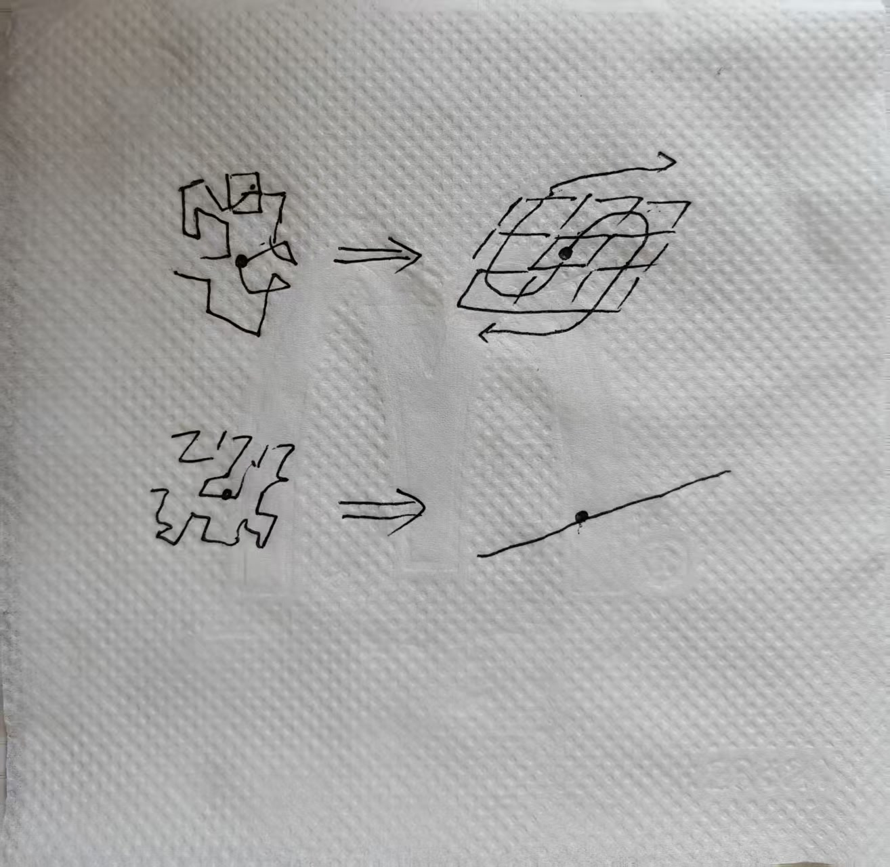
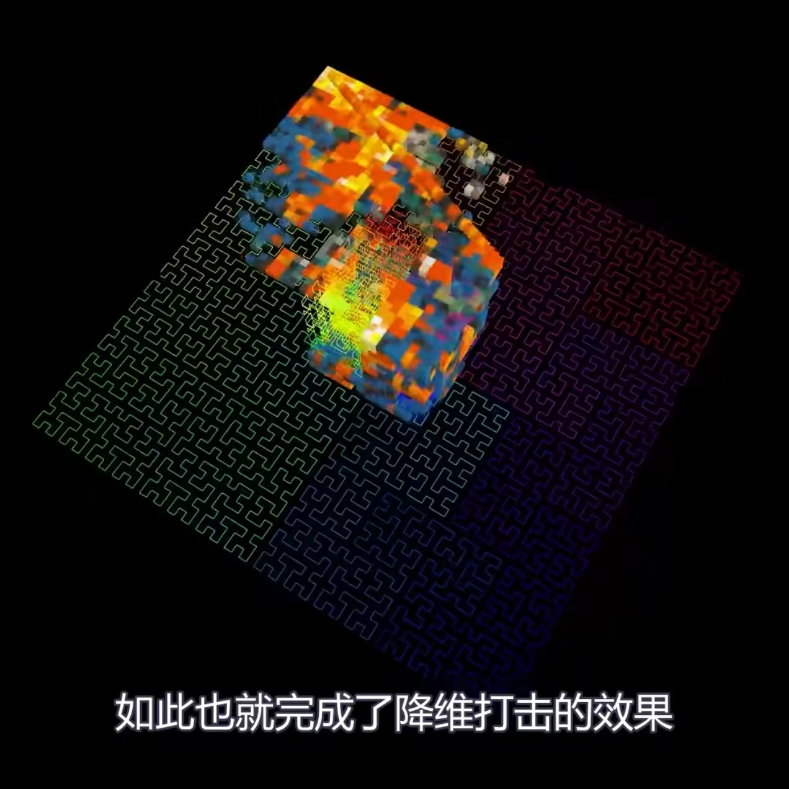
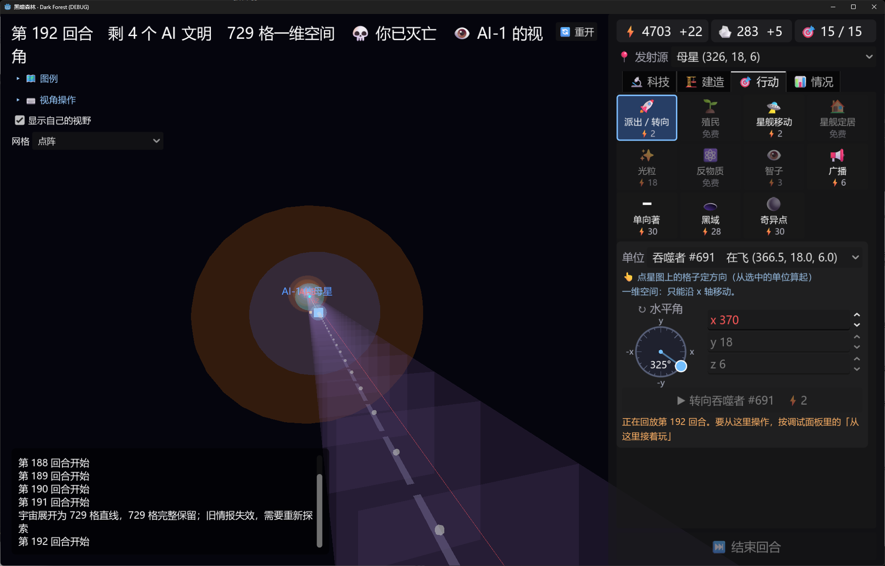
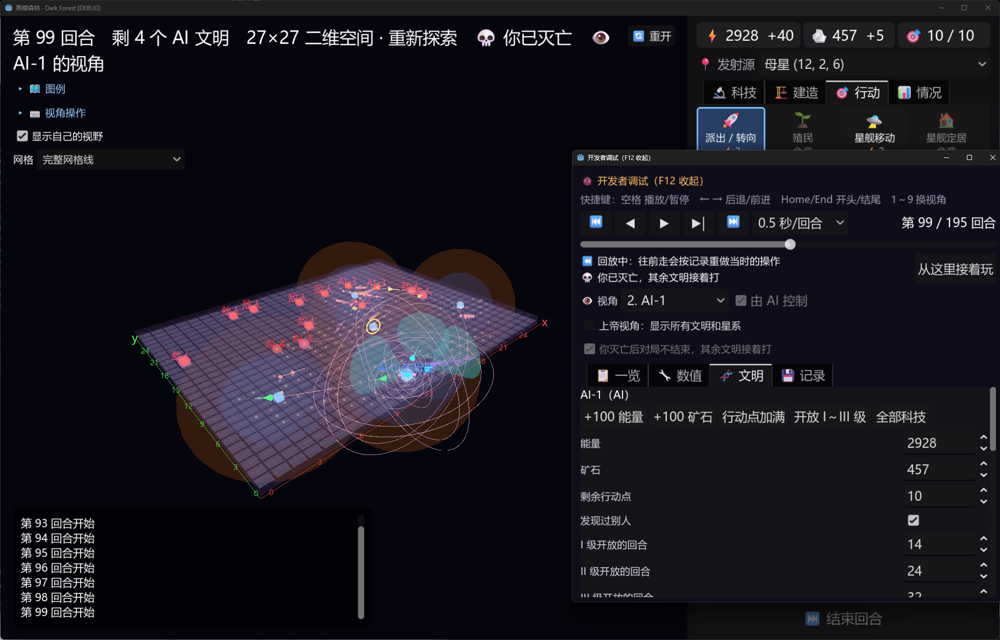
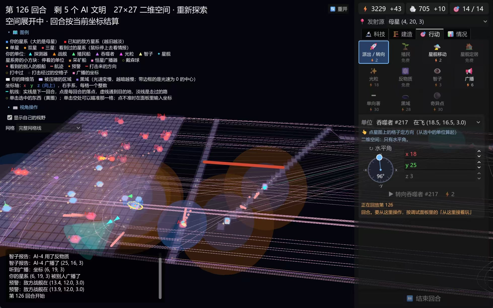

## 执行范围

以已合并的降维展开版本为功能基线，完成下面的后续需求。现有的三维到二维再到一维展开、完整保留格子和重新探索已经做过，不作为新功能重复实现；重点是替换映射方式、支持多个局部展开原点，并修正操作和规则。需求由 E7F6 提出，RainZL 补充了操作问题和固定映射的解释，hrwu1 补充了展开速度与视效建议；数值调整由 ccl 负责。

各任务中的“需求”是讨论明确提出的目标，“实现建议”和“验收”是为 agent 执行补充的说明。“候选调整”和“待确认”不能直接当作正式规则。本文只记录这批需求，实际实现进度见[路线图](../roadmap.md)，已运行的规则见[原型现在的规则](../design/current-rules.md)。

执行前阅读[代码结构](../guides/code.md)，遵守规则与画面分离、数值集中管理、回放可重现和文档同步等约定。已有的“全图展开完再一次性换坐标”约定与下面的局部切换目标存在差异，需要在实现时明确调整设计和对应指南，不能只改动画后就宣称规则已经支持局部降维。

## 执行顺序

1. 先修二向箔精准落点、一维镜头与操作、广播显示和 AI 探测方向，这些任务可以独立处理。
2. 在[降维展开演示](../guides/dimension-unfolding.md)里验证固定映射、单原点展开和多原点合并，再接入真实对局。
3. 明确混合维度结算和奇异点的边界情况，再完成对应规则、界面和回放。
4. 使用候选速度做数值试验，记录科技节奏与进入一维的比例，再由 ccl 调整数值。

## 待办：二向箔精准落点

需求：二向箔是指定坐标的精准打击武器。取消飞行途中遇到敌方星系就提前展开的规则，必须到达指定坐标后展开；目标坐标可以没有文明，也可以位于两个文明之间，同时威胁双方。目标选取允许空格子，交互方式参考现有广播选点。

实现建议：检查 `game_state.gd` 中箔的移动、命中和展开判断，以及 `foil.gd`、行动页和 AI 的目标选择。这里明确取消的是二向箔的路径拦截，不要顺带改变光粒、战舰或单向著的命中规则；也不要把“参考广播选点”解释成瞬间抵达。

验收：构造发射源、路径上的敌方星系和更远的空目标格，二向箔经过敌方星系时不展开，到空目标格后正常展开；投在两个文明之间时，两边按到落点的距离先后受到波及。玩家与 AI 调用相同的规则函数，回放结果一致。

## 待办：预先固定三维、二维和一维映射

需求：生成星图时就为每个格子预先确定三维坐标、二维坐标和一维坐标。它们是同一批格子的不同排列；打击原点改变展开顺序与动画，不改变最终映射。某点被波及后显示对应低维坐标，未被波及的点继续显示原维度坐标。

现有按柱展开会把三维里同一列两端的文明突然放得很近，例如原本处于同一列的 \(z=1\) 与 \(z=9\)。新方案应参考皮亚诺式或其他空间填充曲线，把所有点想成一根线上串着的珠子，再把这根线排列成体、面或直线；尽量保留原有的局部邻近关系，并减少远距离点突然相邻的情况。具体曲线算法尚未选定，不能把“所有点的距离完全不变”作为验收要求。

实现建议：优先检查 `dimension_space.gd`、`unfolding_layout.gd` 和 `star_map.gd`，使用稳定的格子标识关联不同维度的坐标。先做候选映射对比，再选满足目标的方案，不必拘泥于草图的线形；候选方案要展示原本近邻及远距离样例在降维后的变化。

验收：三维、二维和一维排列各自无重复、无丢格；保留现有 729 格、二维 27 格边长和一维 729 格长度。对同一张星图改变打击位置、数量或顺序，最终二维与一维坐标仍一致；从偏离中心的位置展开时，触发点不必成为最终地图中心。



草图表达的是“一组珠子沿固定顺序排列成不同维度”，黑点代表触发位置，箭头表示展开方向；不要把草图当成完整算法。

## 待办：多个原点独立扩张并合并平面

需求：每个二向箔从实际到达的目标点开始，以球形范围向外扩张，离原点越远的格子越晚受影响。被波及的点切换到预先计算的二维排列，未被波及的点继续保留三维状态；周围空间可以适当拉伸，为平面腾出位置。扩张顺序与显示拉伸分别处理，不能因为镜头里的位置改变就提前判定某个格子被波及。

允许多个二向箔同时飞行和展开，不能限制成全图同时只能有一个。每个原点独立推进自己的波及范围，只要一个点被任意波及范围覆盖，就进入低维状态；重叠点只处理一次。不同落点的精确程度和到达时间必须能够影响文明先后被波及的顺序。

每个原点先形成自己的局部平面，最后逐渐向第一个展开的二维平面靠拢。若首批多个二向箔在同一回合展开，最终基准平面取这些原点所在平面的平均 \(z\) 值并取整；之后出现的原点向这个基准平面靠拢。最终二维坐标仍使用固定映射，平面的高度和移动只描述展开表现。

实现建议：演示至少提供单原点、同回合双原点、先后双原点和波及范围重叠的可重现场景。动画应表现三维空间逐渐出现多个球形空区，空区内的点铺成局部平面，再合成完整平面；平移、旋转、缩放时仍能辨认这些区域。

验收：每个原点的波及时间独立计算，较远格子不因另一个原点的动画提前消失；重叠区域没有重复伤害或重复迁移。同回合原点的处理次序不改变结果，局部平面合并时格子不丢失、不重叠、不突然跳到另一套最终映射。演示和真实对局共用映射与展开计算。



该图用于理解体与面沿固定曲线对应的效果。它没有展示本游戏要求的多个打击原点，因此多原点过程按本节文字实现。

待确认：平均 \(z\) 值遇到半整数时如何取整，以及局部降维期间跨维度移动、攻击、视野、广播、黑域、设施与情报如何结算。特别要明确“低维外观”与“规则已经换坐标”的关系，避免用画面插值位置当作规则距离；这些问题未定前可先完成演示和方案说明。

## 待办：一维镜头与操作适配

需求：保留长直线的一维地图，解决镜头移不动、远处文明看不清和操作仍像二维的问题。重点是能沿直线浏览、定位对象、选点和发出行动，而不是为了把全图塞进屏幕而缩到所有文明都看不清。

实现建议：检查 `map_view.gd` 的平移、缩放、边界与对象选中，以及 `action_page.gd` 和 `angle_dial.gd` 的输入。一维移动只能沿直线的两个方向，目标选取与坐标输入应符合一维状态；保留方便返回己方据点或选中单位的操作，并在界面说明实际支持的操作。小地图是 RainZL 提出的候选方案，只有镜头与定位功能仍不足时再设计，不是必须新增的功能。

验收：可以从直线一端浏览到另一端，近看时对象可辨认、可点选；远近缩放、定位据点和选中单位后不会卡住。界面不提供无效的二维方向操作；一维长度不因视角修复而缩短。在 1280×800 下检查操作面板与地图可用性。



截图说明一维阶段仍存在球形显示和二维方向控件，并且长直线不便浏览；按实际规则决定哪些显示需要降维适配。

## 待办：广播与辅助显示适配维度

需求：二维阶段的粉色广播环要适配平面，避免继续显示为多方向的立体圆环。降维期间广播、航线、格子、对象标记和选中轮廓应跟随对应对象的空间表现，不能脱离星系位置或造成错误的目标选取。

实现建议：先区分广播真正的传播范围和用来表示它的线条。只修显示时不改变广播传播规则；二维平面里的广播使用与所在平面一致的表示，一维阶段的显示方式需要能读出直线上的传播范围。空间拉伸时，辅助显示不能因为复用错误的坐标而无限拉长或覆盖操作面板。

验收：二维完成后没有悬在平面外的广播球形圆环；展开途中广播中心、航线端点和选中标记仍对应正确对象。分别检查三维、混合展开、二维和一维的实际截图，既不泄露当前文明未知的对象，也不让纯画面变形影响传播判定。



## 待办：改善 AI 探测方向

需求：E7F6 观察到 AI 会朝宇宙边缘探测，应检查并避免缺少收益的向外探测。这里的目标是改善探索选择，不能通过读取未发现文明的真实位置来选方向。

实现建议：先用固定种子或摆局面复现，检查 `ai.gd` 如何选择探测方向。依据已知情报、尚未探索的有效区域和当前地图边界选择方向，并适配二维与一维的新边界；不要把所有朝边缘的探测都禁止，边缘内的未知区域仍可能值得探索。

验收：靠近地图边界、内部仍有可探索区域时，AI 不反复把探测器派向没有有效探索范围的方向。未知区域仍可探索，AI 不偷看敌方坐标；提供修复前可复现、修复后通过的规则测试。

## 待办：奇异点逐步删除一维坐标

需求：一维到零维的阶段不再保留全部信息。投放奇异点的目标坐标先消失，下一回合其左右两边消失，随后继续向两边删除，一维直线持续缩短；被波及的文明直接消失，最后剩余的文明获胜。实现这一规则时，不再沿用“所有对象一起挤到一个零维点”的收尾方式。

实现建议：先明确规则上的删除与画面上的缩短如何对应，避免删除格子后剩余格子的重新编号改变波及顺序。检查奇异点行动、胜负判定、单位目的地、星系和设施的引用、广播与情报，以及 `map_view.gd` 的收尾动画。

验收：从中部投放时首步仅删除目标格，后续按原直线相邻顺序向两边推进；从端点投放时只向存在格子的一侧推进。删除对象不留下可选中的残影或悬空引用，缩短后镜头仍可操作；最后仅剩一个文明时正确结束对局，回放重现同样结果。

待确认：“文明直接消失”是整个文明灭亡，还是只删除受波及的星系和舰船；拥有其他据点或星舰的文明怎样存活。还要确定发射到生效是否有延迟、能否同时存在多个奇异点、所有文明同回合消失时如何判定。这些规则未明确前，先准备删除过程的演示与结算方案。

## 候选调整：扩张速度与科技节奏

二向箔扩张速度的候选值是 \(0.5c\)，E7F6 提出后 hrwu1 表示认可。执行时先核对 本分支数值文件中的实际基线值，聊天里说过的 \(0.99c\) 不能直接当作代码现值；不要混淆箔在路上的飞行速度和到达后的扩张速度。hrwu1 还提出过逐步减速，但没有定下计算方式。

先用单原点、多个原点和曲率舰船逃离的场景试验 \(0.5c\)，让半格进度累积到后续回合，而不是每回合取整后停住。局部低光速区域是否影响降维扩张、影响方式是什么，也需要结合现有黑域规则明确，不能自行增加一套公式。单位距离按 1 光年、每回合按 1 年理解。

整体节奏目标是每一级科技都有足够的使用阶段，玩家能建造并使用该级设施和单位，而不是迅速跳到最高级。由 ccl 调整科技研究、建造和调度的资源花费；先运行基线模拟，再比较候选数值，避免只凭单局感受改所有价格。

E7F6 希望大约 25% 的对局进入一维，将其作为最后的决胜阶段。这是平衡目标，不是硬性禁止其余对局进入一维的规则。统计进入各维度的比例、回合数、各级科技停留时间和主要淘汰方式，结果写进[现状](../status.md)，候选参数放在项目已有的数值方案中。

## 待确认：距离畸变与死线生成黑域

距离畸变的想法是：降维边缘的空间被拉长后，舰船实际要走的路更长，从而产生类似引力的逃离困难。但没有确定这是纯显示拉伸，还是规则距离也随之改变；下面截图中的两个相邻星系是否仍相距 1 格，就是要回答的问题。建议先将拉伸限制在画面，另行评估规则距离变化会怎样影响航行、攻击、广播和情报。



死线生成黑域的候选规则是：近光速飞行留下航迹死线；同一星系残留两条以上死线时，删除这些死线并形成零光速黑域，黑域逐渐向周围扩散。另一个描述是近光速飞行至既有死线附近会扰动它，使之破裂产生黑域。要先确定两种描述是同一触发条件还是两种条件，以及速度门槛、附近范围、两条死线的判定和扩散方式；不能直接把现有普通航迹全部视为死线。

这些提案先形成规则选项与影响说明，交 E7F6 确定后再进入正式实现。混合维度结算、平均平面取整和奇异点边界情况也按同样方式处理；确认过程中不影响独立任务和展开演示的推进。

## 交付与验证

每项任务交付实现、对应规则或画面测试、必要的实际截图，以及文档更新。改规则时先写能重现旧行为的失败测试，再实现；用固定种子验证多个原点、重叠范围和回放，不以动画看起来正确代替规则检查。画面改动按[截图检查画面](../guides/code.md#截图检查画面)验证，特别检查混合维度和一维操作。

新规则落地时给决定登记来源编号，更新[决定记录](../design/game-design.md#14-决定记录)、[游戏设计](../design/game-design.md)和[原型现在的规则](../design/current-rules.md)；已答问题按仓库约定归档。改动坐标存储或规则结算后，检查回放格式是否需要升级，旧记录不得静默重算成不同对局。

完成代码任务后运行以下完整测试，每组都必须输出“0 个失败”；自动更新的文档与实现一起提交。只整理本文时运行文档检查即可。

```powershell
uv run game/tools/test.py
```

执行经过写进当月开发日志，完成状态写进路线图；平衡模拟结果只写在现状。本文作为需求来源保留，其他文档通过链接引用，避免重复维护整份待办。

## 独立工作边界

本分支从 `master` 的降维展开版本开始，只负责本文的后续需求。数值配置迁移属于 `balance/config-file` 的独立工作，不复制其代码或文档改动，也不在本分支重复实现；核对数值来源时以本分支实际文件为准。决定记录在本基线的游戏设计正文中，后续若文档结构更新，再同步链接。
