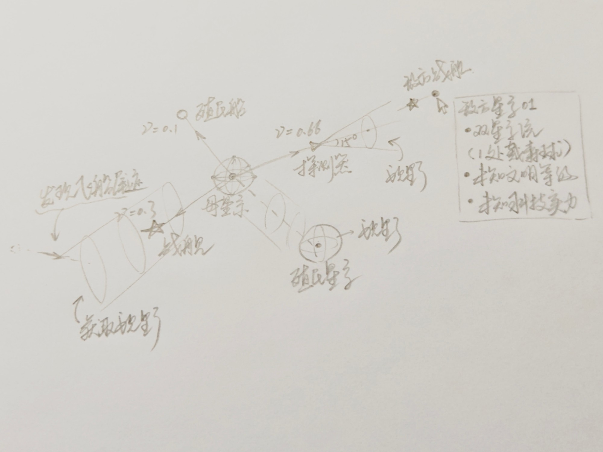

# 光速、移动和情报（已采纳）

状态：**已采纳**（2026-10-06）。结论已经写进 [游戏设计 §3、§4、§6、§8](../design/game-design.md#3-时间距离和移动)，以那里为准；
实现的任务见 [路线图](../roadmap.md)。后来的 [科技树提议](tech-tree.md) 又改了其中几处
（探测器的加速度、视野的形状和大小、二向箔的速度），游戏设计里已经按改过的写。
这里的「单向箔」后来改名叫「单向著」，「探测范围」在游戏设计里叫「视野」。

来源：E7F6 在 2026-10-05 试玩后提的意见和一张草图，由 RainZL 转述。原来的 §1～§5
（时间和距离、移动、光粒、广播、情报）已经挪进游戏设计，这里只留草图和问答记录：
§6 是问题、选项、推荐和 E7F6 的决定，§7 是和以前的决定的冲突怎么解决的。
问答里说的「§2 的表」「§5」指的是挪走以前的章节（还能在 git 历史里看到），内容见游戏设计 §3、§4。

## E7F6 的草图

草图里画的是：

- 母星系和殖民星系周围各有一个球，是它们的探测范围。
- 探测器（速度 0.66）朝右飞，前面是一个张角 15° 的圆锥。圆锥前方有「敌方星系 01」和一艘敌方战舰，
  鼠标停在上面时显示星系的信息。
- 战舰（速度 0.3）朝左下飞，航线周围是一根圆柱；圆柱碰到了一段航迹（「发现飞船尾迹」）。
- 殖民船（速度 0.1）朝左上飞，没有画探测范围。
- 母星系和殖民星系之间也画了一段圆柱，没有标注（见 G7.1）。

## 6. 要决定的事

### 一览

| 编号 | 问题 | 推荐 |
| --- | --- | --- |
| G1 | 速度怎么累加 | A：先加速，再移动 |
| G2 | 光粒的射程、库存和价格 | 射程不限；全文明共用库存，最多 3 颗；造 8M，发射 18E |
| G3 | 恒星广播器和引力波发射器 | B：合并成「广播站」 |
| G4 | 广播从哪里传出、要不要准备 | 从广播者传出；不用准备 |
| G5 | 隐藏文明的反应 | A：听到才判定，出手的光粒按光速飞过去 |
| G6 | 被打后知道方向 | A：打到就知道，被挡下的也算 |
| G7 | 探测范围的细节 | 所有单位都有探测范围；战舰圆柱半径 = 探测距离；星系一直看着 |
| G8 | 战舰能不能转向 | A：能，1 AP + 2E，速度不变 |
| G9 | 哪些单位有目的地 | 箔、殖民船、星舰有；光粒、战舰、探测器没有 |
| G10 | 准备回合要不要跟着改 | A：先不改 |
| G11 | 星图大小 | A：先保持 10×10×10 |
| G12 | 星系信息怎么显示 | 能看到飞船；先不做「文明等级」；旧情报标回合数 |
| G13 | 航迹的细节 | 只有探测器留；永久；发射时可以先慢速飞一段 |

下面每条写选项、推荐和理由，讨论后填「决定」。

### G1. 速度怎么累加

- A：每回合先加速，再按新速度移动。第一回合走的距离等于加速度（光粒第一回合走 0.5 格）。
- B：先按旧速度移动，再加速。第一回合原地不动。
- 推荐：A。
- 理由：发射当回合就能看到单位动起来，比较直观；§2 的表也是按 A 算的。
- 决定：A

### G2. 光粒的射程、库存和价格

- 射程：
  - A：不限射程，沿方向一直飞，打中第一个别人的星系或飞出星图为止。
  - B：有射程上限（例如 5 格），可以升级。
  - 推荐：A。理由：原著里光粒没有射程限制；飞得慢已经是代价，被打的一方有时间准备。
- 库存：
  - A：全文明共用一个库存，从任何发射源都能发。
  - B：每个星系各存各的。
  - 推荐：A。理由：简单，玩家不用记哪颗光粒在哪里。
- 数值：推荐最多存 3 颗，造一颗 8M，发射一次 18E。理由：发射沿用现价；
  矿石现在主要用来造船和戴森球，造光粒花矿石正好让两种资源都有用处。上限 3 颗和反物质一样，防止一次囤太多。
- 决定：A，没有射程上限；B，每个星系最多存储1颗

### G3. 恒星广播器和引力波发射器

- 光粒不再需要恒星广播器以后，两者都只管广播，作用完全一样。
- A：保留两种，只是价格不同。
- B：合并成一种「广播站」。
- 推荐：B。
- 理由：作用一样的两个建筑只会让人困惑；E7F6 在信息框里也写的是「广播站」。
- 决定：A，保留两种，其中引力波发射器可以装在飞船上，见后续科技树相关说明

### G4. 广播从哪里传出、要不要准备

- 从哪里传出：
  - A：从广播者的星系传出。听到的人知道被广播的坐标，也知道信号从哪个方向来，
    广播者因此有一点暴露（和 [B6](../design/archive/decided-questions-2026-10.md#b6-广播会不会连带暴露) 有关）。
  - B：从被广播的坐标传出，广播者不暴露。
  - 推荐：A。理由：信号总要从某个地方发出，B 在物理上说不通；广播有暴露自己的风险，
    也更符合黑暗森林「发出声音就危险」的意思。
- 准备时间（现在是 2 回合）：
  - A：保留 2 回合。
  - B：取消，下单当回合就开始传播。
  - 推荐：B。理由：信号按光速传到别人那里本身就要好几回合，再加准备时间就太慢了。
- 决定：A，从广播者的星系传出，但不知道具体方位，所有文明根据距离广播者的远近依次获知信息，需要说明的是，允许广播任何一个坐标，不一定在该处发现了文明；B，当前回合开始传播，按光速沿球面进行扩张传播

### G5. 隐藏文明的反应

- A：信号传到隐藏文明的那一回合，按现在的概率决定是否出手；出手就发一颗光粒，按光粒的速度飞向目标。
- B：听到后固定过 2 回合打到（现在的做法）。
- 推荐：A。
- 理由：和光粒、广播的速度规则一致；离得越远，打到越晚，正好体现距离。
- 决定：A，隐藏文明在获知信息后，每回合都有一定概率出手，以较大概率发射光粒，较小概率精准投送二向箔，隐藏文明均拥有一个坐标（星图外，可以为负），根据远近依次收到广播，隐藏文明不会主动发现星图内文明，只能依据广播信息出手

### G6. 被打后知道的方向

- A：光粒和战舰打到星系就知道方向，包括被预警系统、反物质挡下的。
- B：只有真正造成损失时才知道方向。
- 推荐：A。
- 理由：被挡下也说明有人在打你，知道方向才能防守或反击。被黑域挡住的不算，因为打击没有到达。
  二向箔、单向箔不给方向，它们展开的位置本来所有人都看得到。
- 画面在星图上从被打的星系朝来处画一条射线；AI 也会朝这个方向派探测器或反击。
- 决定：A，目前考虑预警系统预知打击的来临，是否使用反物质进行防御需要玩家发出指令，占用行动点数，已经建造完成的掩体将自动防御光粒打击（以损失1颗恒星及其戴森球的代价）

### G7. 探测范围的细节

- G7.1 星舰和殖民船有没有探测范围：
  - A：有。星舰是球（和星系一样），殖民船是沿航线的圆柱（和战舰一样）。
  - B：没有，只有星系、探测器和战舰能看。
  - 推荐：A。理由：E7F6 说「所有单位都是这个值，只是探测手段不同」；
    草图里母星系和殖民星系之间那段圆柱，很可能就是殖民船飞过去时的探测范围。
- 决定：A，目前考虑母星系的视野为2.0，殖民星系/星舰的视野为1.5，战舰（改为舰队）的视野为1.0

- G7.2 战舰圆柱的半径：
  - A：等于探测距离。
  - B：等于战舰的打击宽度（现在是半径 0.5 格再加半格）。
  - 推荐：A。理由：E7F6 说探测距离所有单位共用。
- 决定：战舰（改为舰队）的打击宽度为0.5，探测半径为1.0

- G7.3 星系和星舰的球是一直看着，还是也只是某一刻的样子：
  - A：一直看着，每回合更新，附近的变化马上能看到。
  - B：也只是某一刻的样子，要再做点什么才更新。
  - 推荐：A。理由：星系和星舰不会离开，没有理由看不到家门口的变化；
    「只是某一刻的样子」这条只用在会飞走的探测器和飞船上。
- 决定：星系、星舰的球一直以当前位置看着，每回合更新，无法获取已经掠过星系的后续视野

- G7.4 张角和探测距离的上限：推荐张角最大 60°（升级 3 次），探测距离最大 10 格。
  理由：和现在的上限一样；60° 以上的圆锥差不多什么都能看到。
- 决定：张角每次升级+15°，最大为60°

- G7.5 价格：推荐升级射电望远镜 8E，造一个探测器 10M（都沿用现价）。
- 决定：价格沿用现价，后续根据平衡度另行讨论

- G7.6 看到的信息是马上知道，还是要等信号按光速传回来：
  - A：马上知道。
  - B：按光速传回，离得越远知道得越晚。
  - 推荐：A。理由：B 更真实，但要给每条情报记「什么时候到」，玩家也很难看懂；先做 A，以后再考虑。
- 决定：B，按光速传回最近的星舰/殖民星系/母星系，如果是敌方文明的位置、战舰（改为舰队）、航迹，则在信息传回母星系后显示在星图上，其余细节信息在传回后，支持鼠标悬停在星系上显示信息栏

### G8. 战舰能不能转向

- E7F6 说「如果没有转向指令」，意思应该是战舰能中途改方向。
- A：能转向，花 1 AP + 2E，速度不变。
- B：不能转向，只能一直飞。
- 推荐：A。
- 理由：战舰飞得慢，发现目标变化时能改方向才有用；花 AP 和能量，不会被随便用。
- 决定：A，若为大角度（超过90°）转向，从0开始加速

### G9. 哪些单位有目的地

- 推荐：
  - 二向箔、单向箔：有（目标格子），和现在一样。
  - 殖民船：改成选一个目的地星系，到了就定居。现在是「停在路上第一个能殖民的星系」。
  - 星舰：选目的地，到了就停下，速度归零；下次移动重新加速。
  - 光粒、战舰、探测器：没有目的地，一直飞。
- 理由：殖民船很慢（5 格要 27 回合），飞错了损失很大，应该让玩家指定去哪；
  星舰要能停在某个位置当发射源；武器和探测器按方向飞，符合「沿方向行动」的基本规则。
- 决定：二向箔，单向箔（改为单向著），星舰，殖民船

### G10. 准备回合要不要跟着改

- 1 回合变成 1 年以后，二向箔准备 2 回合、黑域准备 2 回合、自身降维 3 回合这些数字的含义也变了。
- A：先不改。
- B：按新的时间尺度加长。
- 推荐：A。
- 理由：现在还不知道新节奏下一局有多长，先实现，跑平衡模拟后再一起调。
- 决定：A

### G11. 星图大小

- 殖民船飞 5 格要 27 回合，探测距离开始只有 1 格。现在平衡模拟一局最多打 100 回合，
  第一次发现别人的中位数是第 6 回合，离 E7F6「很长一段时间找不到」的设想差得很远。
- A：先保持 10×10×10。
- B：直接放大（例如 20×20×20）。
- 推荐：A。
- 理由：探测距离只有 1 格、单位又慢，10 格的星图已经会让找人变难很多；
  同时改速度和星图大小，就分不清是哪个改动造成的效果。先改速度，看模拟结果再决定要不要放大。
- 要注意：找不到敌人的那段时间，玩家要有事可做（发展、殖民、派探测器、找航迹），
  不然会很无聊。平衡模拟可以用「第一次发现别人是第几回合」来衡量这段时间有多长。
- 决定：A

### G12. 星系信息怎么显示

- G12.1 探测范围里能不能看到飞船：推荐能，但只看到那一刻的位置。理由：草图里探测器前方画了一艘敌方战舰。
- 决定：可以看见视野内的敌方飞船。

- G12.2 草图的信息框里还写了「探知文明等级」「探知科技实力」：
  - A：先不单独做，用发展情况（建了哪些东西、升级了几次）代替。
  - B：现在就定「文明等级」「科技实力」怎么算。
  - 推荐：A。理由：这两个数要先有一套计算方法，现在还没有；发展情况已经能说明对方强不强。
- 决定：A，后续根据科技树定义文明等级与科技实力

- G12.3 旧情报：推荐鼠标停上去时写「第 N 回合看到」，越旧的颜色越淡。理由：情报只是那一刻的样子，玩家要知道它有多旧。
- 「广播站」和 G3 一起定；「光粒」指库存的光粒，和 G2 一起定。
- 决定：可以

### G13. 航迹的细节

- G13.1 哪些单位留航迹（按「超过 0.9 倍光速」，现在是探测器和光粒）：
  - A：探测器和光粒都留。
  - B：只有探测器留。
  - 推荐：B。理由：E7F6 说的是「舰船」，光粒不是舰船；被光粒打中时已经知道方向（G6），
    再留航迹就重复了。
- 决定：B，后续会有能够加速到这一速度的舰船，也需要保留（所有历史上曾经以近光速航行过的舰船轨迹都要保留至降维）

- G13.2 航迹留多久：推荐一直留着。理由：原著的死线是永久的。
- 决定：对的

- G13.3 能看到哪一段：推荐只显示落在探测范围里的那几段，看到以后就记住；看不出是谁留下的。
- 决定：对的

- G13.4 怎么做到「先慢速离开、再加速」：按 §2 的固定加速度，探测器第 3 回合就超过 0.9，
  那时离母星只有 1 格左右，航迹会直直指着母星。
  - A：发射时多一个选项「先慢速飞几格」：这段距离里速度不超过 0.9，不留航迹，飞完再加速。
  - B：等曲率引擎这项科技定下来再说：加速到近光速要靠曲率引擎，什么时候开由玩家决定。
  - 推荐：先做 A，曲率引擎定下来后改成 B。理由：A 简单，马上就能玩出「藏住母星」的意思；
    B 要等 E7F6 想好曲率引擎。
- 决定：A，先以慢速（0.15c）飞出自身星系的视野范围

- G13.5 航迹挡不挡东西：推荐先只当作情报，不挡任何东西。理由：原著里死线是黑域，
  要和曲率引擎、[B4 黑域](../design/archive/decided-questions-2026-10.md#b4-黑域)、[D4 光速飞船](../design/archive/decided-questions-2026-10.md#d4-光速飞船曲率驱动) 一起考虑。
- 决定：死线无法像黑域一样抵挡攻击，考虑后续舰船在死线周围行驶有概率扰动死线，扩张成为黑域，后续再做

## 7. 和已有决定的冲突

| 编号 | 已填的决定 | 这次的提议 | 推荐 |
| --- | --- | --- | --- |
| B2 光粒的射程和飞行时间 | A：射程 5 格，当回合打到 | 以光速飞，要飞好几回合 | 改成新提议，见 G2 |
| B5 广播的延迟 | 保持现状：准备 2 回合，隐藏文明 2 回合后打到 | 按距离以光速传播 | 改成新提议，见 G4、G5 |
| B8 怎样发现别人 | 保持现状：主动圆锥探测为主 | 只能靠自己的单位看到、监听和被打 | 改成新提议，见 §5、G6、G7 |

理由：这三条旧决定都是在「光粒当回合打到、探测当回合看到」的前提下定的。改成按光速以后，
旧的做法会和「光速最快」矛盾。

更新（2026-10-05）：E7F6 已经把 B2、B5 改成 B，B8 也改成了新的发现规则（看到对方的星系才算发现），都和这份提议一致。

E7F6 填的决定之间原来还有几处对不上，现在都定了：

- 二向箔的速度：§2 的表写 0.5，[B7](../design/archive/decided-questions-2026-10.md#b7-二向箔) 决定展开前每回合飞 0.2，以 B7 为准。
  展开后的速度 B7 里有 0.9 和 0.99 两种写法，见 [要确定的问题 T17](../design/archive/decided-questions-2026-10.md#t17-二向箔展开后的速度)。
- 战舰打不打星系：已定，打没有防御的星系，也不再封锁广播。见 [科技树提议 T9](tech-tree.md#t9-战舰打不打星系)。
- 探测器的加速度和探测距离：科技树提议改了，见本文开头。
